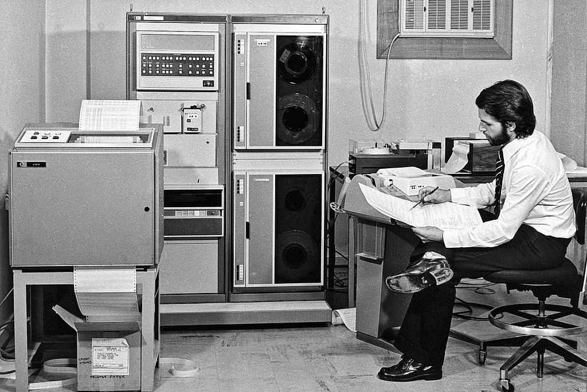
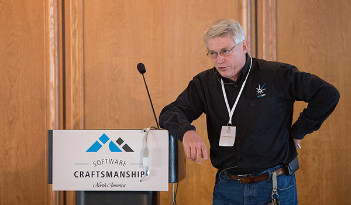
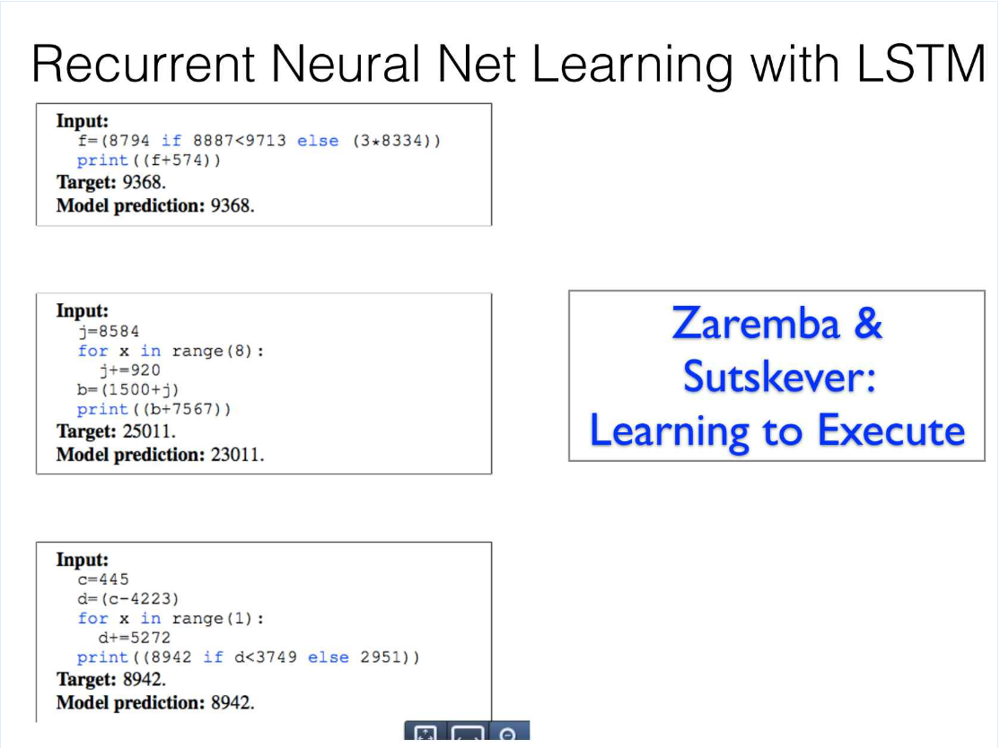
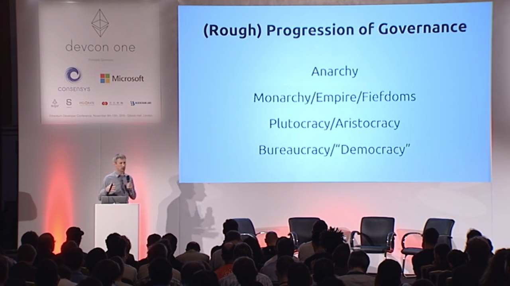

[Software is eating the world][6], Moore's law [continues][18], and quantum computing is getting [closer to primetime][19]. With this incredible progress before us, it's hard not to feel the future is bright.

However, techno-optimism isn't the only nararative in town. The tech industry faces several **challenges**, from the increasing difficulty of packing more transistors into a smaller and smaller space to managing the complexity of parallel computing, but the problem in the tech industry that gets the most airtime is the colossal **[talent shortage][7]**. The best-funded firms aren't able to hire as quickly as they would like, and the less-well-funded firms are forced to settle for less-capable talent. 

Thankfully, there are many organizations and individuals dedicated to closing the talent gap, primarily through new efforts in [education][23], [diversity][24], and [recruiting][1]. 

Certainly there is always **room for improvement**, but I'd like to leave this side of the issue (increasing supply of programmers) in these capable hands.

 
<em> Our limited mental faculties. </em>
 

The other, critical side of the issue that few people discuss, or even acknowledge is that the **[tools][10]** we use aren't maximizing the effectiveness of our meager human **brains**.

Before you dismiss this as mere hyperbole, consider that the tendrils of technology extend far beyond Silicon Valley, Facebook addiction, and the latest iDevice. No. The **stakes** are far higher than the stock price and cultural sway of a few high-profile tech giants.

The **health of our economy**, all the way down to the average retirement plan, is [predicated on exponential technological growth][8].

Thus, if we, the technologists, don't keep pace, many people will be left out in the cold. Put differently, we are entering a world in which, "when the tech industry sneezes, the world catches a cold."

The good news is that we technologists are faced with the opportunity of a lifetime: to help the world keep pace and to build a better future together.

So, I'd like to share my vision of where the world of computation is going and how you and I, can start making a difference, today.

### Tools

My thesis: improving our development tools can completely change the game. 

 
<em> Steve Jobs Prognosticating in 1995 </em>
 

Steve Jobs once argued that man's superpower is in building tools, likening the personal computer to a ["bicycle for the mind."][25] He goes on to argue that, ["of all the inventions of humans, the **computer** is going to rank near if not **at the top**."][26] So far, Steve's prediction seems astute; the computer has changed the face of virtually every human discipline, so much so that popular opinion embraces the idea that; many acknowledge that many jobs will, within our lifetime, be performed by computers.

What saddens me is that most of us are content with fixies when we could have *Ferraris*!

One would think that recursive power of developers developing development tools would lead to **staggering**, exponential productivity gains, but somehow that **hasn't happened**.

As they say, "the cobbler's children always go **barefoot**."

#### Old Paradigm

 
<em> Debugging: just like it was in the 1960s, minus the business attire </em>
 
<a href="http://www.eso.org/public/images/potw1223a/"> Photo credit: ESO </a> / CC BY-SA 3.0 

Despite the growth and adoption of new languages and methodologies, there are gaping holes in our core computing model. Computing hasn't changed much in [30+ years][11]. Text-based, operating system-enabled programming has been around for more than 50 years. That is, modern programmers could be warped back to the 1960s and placed in front of a teletype, and be comfortable and familiar with the tooling with a minimal amount of training! 

We like to brag about how quickly our industry moves compared to others, but the truth is that the fundamentals haven't changed much in a **long, long time.** 

In a static world, this is fine. However, in a world that has seen exponential growth in computing power, userbase, and developers, how can we afford to cling to the tools & methodologies from an era where these constants were roughly **10^7** (2^25) less than today?

#### There Will be Code

Given the recent success of AI techniques, more have begun to argue, "Why bother improving dev tools? Code will soon go away completely." However, I subscribe to the [Uncle Bob school of thought][29], which states that:

> We will never be rid of code, because **code** represents the details of the **requirements**. At some level those details cannot be ignored or abstracted; they have to be **specified**. And specifying requirements in such detail that a machine can execute them is programming. Such a **specification is code**.

I'll acknowledge that breakthroughs are indeed being made in the field of using **machine learning** for **programming**. Peter Norvig gives an [incredible talk][20] on this subject, going so far as to demonstrate programming language interpreters developed ENTIRELY using machine-learning techniques!

<em> Programming: Not just for humans anymore </em>
 
<a href="https://www.infoq.com/presentations/machine-learning-general-programming"> Source: InfoQ </a> 

Yann LeCun's team has also done some impressive work on deep learning for general programming, placing a basic Turing machine inside of a reinforcement learning environment until it **learns basic algorithms**, including adding and sorting!

Impressive as these breakthroughs may be, even if this research renders Python, Javascript, and Haskell obsolete, there will still be a **need for programming** and programmers, no matter what the new paradigm looks like.

But what will that paradigm look like?

### Flock of Starlings

My model for the future of computing is a flock of starlings:

<iframe width="560" height="315" src="https://www.youtube.com/embed/DmO4Ellgmd0" frameborder="0" allowfullscreen></iframe>

We each have our own individual voice and insight to contribute, but it's only by **banding together** as a whole that we, as a species, can achieve the unfathomable.

Apple relies on dozens and dozens of suppliers to produce a device.
I'm using open-source contributions from hundreds of developers to publish this post right now.
The packets that are carrying this post to you are being carried by many different intermediaries before they arrive on your screen.
Google's servers index the work of nearly every author on the web and make it instantly available to everyone around the globe.
Wikipedia is a collaboration of thousands of volunteers around the world, resulting in the world's best encyclopedia.

I could go on, but my point is to highlight the beauty of **cooperation** that too-often goes unappreciated by my individualistic American mind. 

Unaided humans may never be able to rival the coordination of starlings, but we've had some success creating great works through the art of cooperation.

Perhaps through the use of better tools, day-to-day software development can take full advantage of network effects?

### Globalization / Decentralization

Speaking of American thinking, the balance of power is shifting. We've heard for many years that "the world is flat," but the reality of global innovation is drawing nearer and nearer.  

Every major city of the world now has a co-working space, programming classes, and usually, a dev bootcamp. Nairobi may never rival San Francisco, but the wheels are in motion and have been for several years now. 

#### Is Tech Innovation Decentralizing?

The question is: are these smaller tech hubs doomed to forever play catch-up? Or will they become birthplaces of true innovation?

<iframe width="560" height="315" src="https://www.youtube.com/embed/Fq1SEqNT-7c" frameborder="0" allowfullscreen></iframe>

Let's look to **China**, the poster child of the developing world. Long-dismissed as a great force of "globalization," rather than "innovation," China is now generating **real breakthroughs**, most notably in [facial recognition][3]. And, given the insane [hardware iteration speed in Shenzhen][5], I suspect we will see that trend continue. 

Is this phenomenon unique to China? Unlikely. 

I suspect that there are innovations bubbling up all around the globe. It's just that we Westerners haven't sufficiently felt their impact to increase our awareness of them.

For example, **Kenya** has been heralded as a pioneer of mobile phone-based transactions since **M-PESA**'s introduction in 2007. But, given that there wasn't great demand for this service in the developed world (due to existing financial infrastructure), we didn't look twice. But M-PESA has found success in other markets, including Afghanistan and parts of Eastern Europe.

In retrospect, this shouldn't be surprising, as we know that there is a diversity of needs in the marketplace. With more players in the global economic game, the swirling interaction of supply and demand will give rise to previously-unimagined goods and services.

##### Israel

Also, while not a developing country, I'd like to call out **Israel** for creating a world-class technology ecosystem, pumping out hit after hit, including titans such as [ICQ][32], [Waze][30], and [Primesense][31]. With [**$10 billion** in startup exits][33], 2016 was considered a *slow* year for them. For a country of only 8.5 million people, this is unbelievable. Here's a very crude comparison: given the United States' population of 323 million, we would have to produce **$400 billion** worth of tech exits annually to keep pace with Israel on a per-capita basis. 

#### Why is Tech Decentralization Happening?

Let's examine the nuts and the bolts more closely:

The plummeting cost of **communication** and **coordination** (Git, Slack) and the rise of tools to aid in **development** (AWS, open source) and **small business** (Stripe, Stripe Atlas) mean that there is more opportunity than ever for small players to shake things up.

Also, the incredible proliferation of **smartphones** and **electronic payments** around the world mean that virtually everyone is becoming a user and customer of software, vastly growing the size of the digital economy.

Critics counter that the surging importance of AI will mean that **data-poor** startups will always lose the battle against the **data-rich** tech giants, leading to a complete centralization of power. However, the giants have ALWAYS had an edge in **funding** and **manpower**, and yet somehow ALWAYS find a way to fall **flat-footed**. Will data-as-firepower make this so different? I'm skeptical.

So long as we can prevent an incumbent-take-all scenario, power, knowledge, and innovation will become increasingly distributed. The hegemony of America and Silicon Valley will continue to slowly erode as other innovators rise. 

#### Decentralization Theory

It turns out that this trend of decentralization of power is not new. 

In fact, Dr. Gavin Wood, co-creator of Ethereum, makes a compelling [case][14] that the evolution of all social systems follows a similar pattern.

<em> Dr. Gavin Wood: Centralization -> Decentralization</em>

Skeptical? Consider his framework for biological and human systems. (Software parallels in parenthesis).

1. All systems begin in **anarchy** (individual programmers). Communication and coordination are very costly, thus individuals work in isolation. 

2. Then, a **king** (Microsoft) gathers a huge mindshare of subjects (developers) to build great works and enforce the rule of law. 

3. As communication/coordination becomes cheaper, wealth becomes more distributed and we see the rise of an **aristocracy** ("bazaar"-style open-source projects such as Linux and Apache). 

4. With the advent of the cheaper communication such as the telegraph (Git), we move to a **democratic** system (branch & fork, "horizontal gene transfer" collaboration model). 

#### What does it mean? 

As an American, I'll admit I'm sad to think we'll lose our dominance, but, let's take a moment to remember that **everyone** will innovate more quickly if there is a truly global dialogue of computation. 

We've seen the power of increasing **diversity of supply** time and again, from Amazon.com to Wikipedia and open source software.

So, my fellow American technologists, I hope we see that that it's human nature to prefer a higher **RELATIVE standing** than a higher ABSOLUTE standing. Similarly, I hope we can acknowledge that it's better for our civilization if we can move beyond this ["crab bucket"][21] mentality to think on a global level. 

Idealism not working for you? Let's take on a more pragmatic viewpoint: if it's going to happen, we may as well make the most of it. :)

Chairman Mao once [wrote][15], "**Let a hundred flowers bloom**; let a hundred schools of thought contend." Though he was speaking of political discourse, the future of our industry looks much the same: a constantly cross-pollinating proliferation of ideas and a constant ebb and flow of cooperation and competition.

Could the next John Carmack come from outside the US?

### How do we get there?

As with any paradigm shift, we cannot **leap** straight ahead to software development practices of the 2050s. 

No, we must **build our way there**, brick by brick, from the present.

While I'm sure that virtual reality programming environments and perhaps human language approaches will one day be highly influential, I dismiss them as not yet close enough to commercialization.

#### Microservices

Instead, embracing and empowering the distributed systems / [microservices][13] trend seems a more aptly-timed approach to enhancing developer productivity.

Clearly, I'm not the only one who has this viewpoint.

<em> Jeff Bezos: Father of Microservices? </em>
 

Indeed, thanks to this movement [spearheaded][9] by Jeff Bezos, the world increasingly implements a service-oriented architecture. 

The core reason is simple: coordinating large groups of humans is [impossibly][17] [difficult][16]; it's far easier to use networked programming interfaces as a means of [communication/coordination][12].

APIs are, with a bit of elbow grease, better-documented and more consistently-behaved than a handshake or a written agreement between two humans.

One step toward flocking like starlings. 

## The Vision

But what specifically about microservices / API development needs to be improved? Where do we go from here?

Off the top of my head, we need to make it much, much easier to,

As an API provider:

* Offer APIs to outside developers 
* Receive compensation for use of one's API 
* Reach new customers

As an API consumer:

* Integrate external APIs 
* Understand ROI / cost-benefit of using an external API
* Discover/evaluate new APIs
* Troubleshooting distributed systems 

As mentioned before, open source is fantastic. However, in order for developers to be paid for their time, we need to have a strong **commercial engine** driving innovation. Recall that while the open source movement was started on the efforts of volunteers, and much of the work is still volunteer labor, keep in mind that a large chunk of high-profile open-source projects are run by a commercial steward, such as Google or Facebook.

Snow Crash and Ready Player One have given us prescient glimpses into a future where a diverse **software economy** offers a plethora of software and data services. Though some aspects of these books may be anachronistic or fantastical, the core vision of a thriving software economy, fueled by seamless interoperability, is incredibly compelling and will seem **obvious in hindsight**.

By addressing these needs of API providers and consumers, we can help this become a reality.

## CTA

### The Real Ask

Though I speak in lofty terms about the future of computing, every grand vision is rooted in the humblest of beginnings. Every wall starts with a **single brick**.

I'm sure that you have some ideas about which piece you'd be most interested in tackling! And I invite you to do so.

As for me, the brick that I've chosen to lay first is the **development and maintenance of API client libraries**. 
Creating a developer experience on par with Stripe or Twilio is a huge undertaking, from developing the API and client libraries, supporting them over time, and providing good documentation and sample code.
My aim is to reduce this burden by taking one component off of developers' hands: the client library. In future, perhaps it'll be more, but I believe it's important to keep a laser-focus in the early days.

I worked on the DoubleClick for Publishers API team at Google and had the humble job of maintaining and supporting the client libraries for that system. At the time, I admittedly didn't appreciate the experience, but it helped to give me the perspective I've needed to arrive here, starting this new venture.

To facilitate easy maintenance of these client libraries, I've built a client library generator that covers basic use cases. 
The basic idea is to concentrate the definition of the API in an IDL (based on OpenAPI)
It's a bit rough around the edges yet, but I am now working with an initial batch of clients

Every system is a [legacy system][22] the day it ships. My dream is to help these systems to stay useful and relevant for many years of dutiful service.

The road is long, but my hope is that this is the first step toward a future of collaborative computing.

[1]: https://triplebyte.com/ "Triplebyte"
[2]: http://www.sam-network.org/video/rencontre-avec-peter-thiel?curation=1363.1 "Peter Thiel: Globalization vs Innovation"
[3]: https://www.forbes.com/sites/ywang/2017/07/11/how-china-is-quickly-embracing-facial-recognition-tech-for-better-and-worse/#12d5e2c06856 "China Is Quickly Embracing Facial Recognition Tech, For Better And Worse"
[4]: https://www.neuronmocap.com/ "Perception Neuron"
[5]: https://youtu.be/SGJ5cZnoodY "Shenzhen: The Silicon Valley of Hardware"
[6]: https://a16z.com/2016/08/20/why-software-is-eating-the-world/ "Why Software Is Eating The World"
[7]: https://medium.com/everyvote/h1-b-visas-and-the-talent-shortage-the-silicon-valley-reality-f9974749e437 "H1-B visas and the talent shortage."
[8]: https://youtu.be/KKLDevYyE9I?t=4m15s "Peter Thiel on Macroeconomics and Singularity"
[9]: https://plus.google.com/+RipRowan/posts/eVeouesvaVX "Steve Yegge on Platforms"
[10]: https://pragprog.com/articles/the-spirit-of-the-tool "The Spirit of the Tool"
[11]: https://youtu.be/id1WShzzMCQ?t=13m7s "Alan Kay - How to Invent the Future"
[12]: https://www.youtube.com/watch?v=kb-m2fasdDY "GOTO 2016 - What I Wish I Had Known Before Scaling Uber to 1000 Services - Matt Ranney"
[13]: https://martinfowler.com/articles/microservices.html "Microservices"
[14]: https://youtu.be/U_LK0t_qaPo?t=12m46s "Dr. Gavin Wood on Centralization/Decentralization"
[15]: https://en.wikipedia.org/wiki/Hundred_Flowers_Campaign "Hundred Flowers Campaign"
[16]: https://www.amazon.com/Peopleware-Productive-Projects-Teams-3rd/dp/0321934113/ref=as_li_ss_il?ie=UTF8&qid=1500524823&sr=8-1&keywords=peopleware&linkCode=li2&tag=davidykay-20&linkId=3133e32f0a933ce70bd4f0248b80f276 "Peopleware"
[17]: https://www.amazon.com/Mythical-Man-Month-Software-Engineering-Anniversary/dp/0201835959/ref=as_li_ss_il?ie=UTF8&qid=1500525043&sr=8-1&keywords=mythical+man-month&linkCode=li2&tag=davidykay-20&linkId=68e39e463943eb549ce343ae3509372c "The Mythical Man-month"
[18]: http://www.telegraph.co.uk/technology/2017/01/05/ces-2017-moores-law-not-dead-says-intel-boss/ "Moore's law is not dead, says Intel boss"
[19]: /Cloud-Quantum-Computing-Heats-Up-as-Rigetti-Launches-API/ "Cloud Quantum Computing Heats Up as Rigetti Launches API"
[20]: https://www.infoq.com/presentations/machine-learning-general-programming "Machine Learning for Programming"
[21]: https://en.wikipedia.org/wiki/Crab_mentality "Crab mentality"
[22]: /An-Ode-to-Legacy-Systems/ "An Ode to Legacy Systems"
[23]: https://flatironschool.com/ "Flatiron School"
[24]: https://www.blacksintechnology.net/ "Blacks in Technology"
[25]: https://www.youtube.com/watch?v=4x8wTj-n33A "Steve Jobs: Bicycle for the Mind"
[26]: https://youtu.be/TRZAJY23xio?t=1h5m19s "Steve Jobs: Computer as Most Important Invention"
[27]: http://ieeexplore.ieee.org/document/5586457/ "Generating a novel sort algorithm using Reinforcement Programming"
[28]: http://www.eso.org/public/images/potw1223a/ "ESO Hewlett Packard 2116 minicomputer.jpg"
[29]: http://www.informit.com/articles/article.aspx?p=1235624 "What is Clean Code?"
[30]: https://en.wikipedia.org/wiki/Waze "Waze"
[31]: https://en.wikipedia.org/wiki/PrimeSense "Primesense"
[32]: https://en.wikipedia.org/wiki/ICQ "ICQ"
[33]: http://www.timesofisrael.com/israel-tech-exits-totaled-10-billion-in-2016-report/ "Times of Israel: Israel tech exits totaled $10 billion in 2016"
