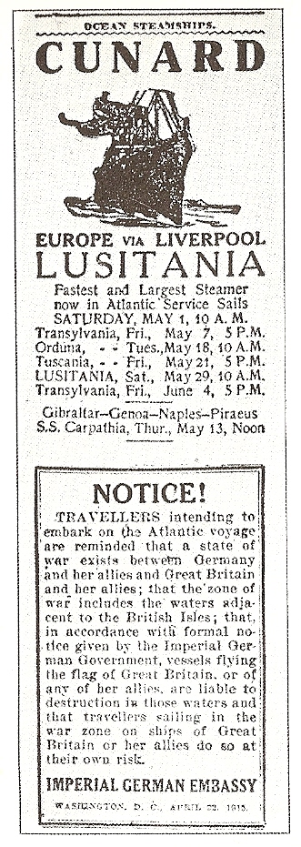

John 8:32 states that "the **truth** shall be known to you, and the truth will set you free." 

Over the next few posts, we're going to take a break from the usual topics of technology, entrepreneurship, and personal development to develop a better sense of what is going on in the world around us.

In school, most of us are taught that the government are *servants* of the people. It seems that this lesson often develops into a sincere trust in government as I often hear intelligent, rational adults state confidently that, "We should trust our government!"

Today, we're going to take a look at a key event during the "Great War," the sinking of the RMS Lusitania, which proves that governments are capable of sacrificing innocent lives and then keeping the secret for decades.

## The Lusitania

The RMS Lusitania was a large British steamship which was sunk by a German U-boat on May 7, 1915 while carrying passengers from New York to Liverpool.

1,198 civilians perished, including British, Canadian, and American citizens, which helped to turn public sentiment against Germany, eventually leading to the United States entry into WW1. 

## The Motive

## UK Losing WW1

At the time of Lusitania's sinking, the British were having a tough time in the war against Germany.

### Churchill's Enticement

One way to improve one's odds in a fight is to bring new friends into it. But how to do so?

Germany had begun a campaign of submarine warfare against British shipping vessels, in order to reduce the flow of supplies entering the UK.

As we know, Germany's sinking of the Lusitania did indeed change American public opinion against Germany. 

But the sinking of the ship was no mere accident.

As early as 1915, Prime minister Winston Churchill took steps to endanger ships of Britain's trading partners, such as the United States, in the hopes that the Germans would sink them.

Here's an excerpt from a letter that Churchill sent to Walter Runciman, President of the British Board of Trade, on 12 February 1915:

> My Dear Walter,  
>  
> It is most important to attract neutral shipping to our shores in the hope especially of embroiling the United States with Germany. 
>  
>  The German formal announcement of indiscriminate submarining has been made to the United States to produce a deterrent effect upon traffic. For our part, we want the traffic – the more the better and if some of it gets into trouble, better still. 
>  
>  Therefore please furbish up at once your insurance offer to neutrals trading with us after February 18th. (The more that come the greater our safety and the German embarrassment). Please act promptly so that the announcement may synchronise with our impending policy.

So, we can see that the idea of losing a few innocent lives in order to gather support for the war began at the very top of the government.

### Target ID

Also, it wasn't enough to provide Germany with more vessels to target. Churchill wanted to increase the chances that the Germans would strike an innocent ship by mistake!

While U-boats (submarines) are most commonly known for their underwater torpedo attacks, they were also capable of fighting on the surface of the water and even had a policy of boarding transport ships before deciding to sink them or not. By boarding a ship and inspecting it, the Germans could verify that this vessel was or was not carrying military supplies, and thus only attack military targets.

Another decision by Churchill was to take great efforts to prevent U-boats from attacking while on the surface. This would greatly reduce the German ability to verify the validity of the target before sinking it.

> The first countermove, made on my responsibility, was to deter the Germans from surface attack. The submerged U-boat had to rely increasingly on underwater attack and thus ran the greater risk of mistaking neutral for British ships and of drowning neutral crews and thus embroiling Germany with other Great Powers.  
> -- [The World Crisis, Vol 2, Winston Churchill][2]

### False Flags

Churchill was also not above ordering his ships to, quite literally, fly false flags.

Churchill also ordered British ships to remove their names and when in port fly the flag of a neutral power, preferably the U.S. flag. 

Also the survivors of the U-boats “should be taken or shot-whichever is the most convenient” and “In all actions, white flags should be fired upon with promptitude.”

### Historians Agree

Many historians believe that Britain [would have lost][9] to Germany without American involvement.

One surprising fact that supports this belief is that, at the time of US entry into WW1, Britain was only [six weeks away][6] from running out of food! 

I think it's fairly easy to see how things could have easily gone the other way without our involvement.

### German Warning About Submarining

German government

On 17 April 1915, Lusitania left Liverpool on her 201st transatlantic voyage, arriving in New York on 24 April. 

Several German citizens became concerned about backlash if Lusitania were to be attacked.

The German embassy decided to warn passengers not to sail aboard Lusitania, and on 22 April placed a warning advertisement in 50 American newspapers, including those in New York.

 
 

</a>

 *Warning*  

 [Photo](https://commons.wikimedia.org/wiki/File:BahnhofsuhrZuerich_RZ.jpg) by [JuergenG](https://de.wikipedia.org/wiki/Benutzer:JuergenG) / CC BY-SA 3.0 

    Notice!
    Travellers intending to embark on the Atlantic voyage are reminded that a state of war exists between Germany and her allies and Great Britain and her allies; that the zone of war includes the waters adjacent to the British Isles; that, in accordance with formal notice given by the Imperial German Government, vessels flying the flag of Great Britain, or any of her allies, are liable to destruction in those waters and that travellers sailing in the war zone on the ships of Great Britain or her allies do so at their own risk.
    Imperial German Embassy
    Washington, D.C. 22 April 1915 

Notice that this this warning was printed adjacent to an advertisement for Lusitania's return voyage!

## The Sinking

"The sinking of the Lusitania had a profound impact on public opinion in the United States. The German government apologized for the incident, but claimed its U-boat only fired one torpedo and the second explosion was a result of a secret cargo of heavy munitions on the ship. If this was true, Britain was guilty of breaking the rules of warfare by using a civilian ship to carry ammunition. British authorities rejected this charge and claimed that the second explosion was caused by coal dust igniting in the ship's almost empty bunkers."

### Eyewitness Testimony

"Sound of a maxim gun"

  The fact is that the ship sank in 18 minutes. That could only happen as the result of a massive second explosion. We know there was such an explosion, and the only thing capable of doing that is ammunitions. It's virtually impossible to get coal dust and damp air in the right mixture to explode, and none of the crew who were working in the boiler rooms and survived say anything about a boiler exploding. I don't think there's any question that there was a steamline explosion, but that wouldn't have damaged the ship to the point where it sunk in 18 minutes. It's blarney, part of another cover story.
  - Millionaire owner of ship

## Munitions

    Torpedo hits starboard side right behind the bridge. An unusually heavy detonation takes place with a very strong explosive cloud. The explosion of the torpedo must have been followed by a second one [boiler or coal or powder?]... The ship stops immediately and heels over to starboard very quickly, immersing simultaneously at the bow... the name Lusitania becomes visible in golden letters.
    
    Schmidt, Donald E. (29 June 2005). The Folly of War: American Foreign Policy, 1898–2004. Algora Publishing. p. 70. 

--The German embassy in Washington was well aware of the nature of the cargo being loaded aboard the Lusitania and filed a formal complaint to the United States government, because almost all of it was in direct violation of international neutrality treaties. The response was a flat denial of any knowledge of such cargo. Seeing that the Wilson Administration was tacitly approving the shipment, the German embassy made one final effort to avert disaster. It placed an ad in fifty East Coast newspapers, including those in New York City, warning Americans not to take passage on the Lusitania. The ad was prepaid and requested to be placed on the paper’s travel page a full week before the sailing date. –Of the fifty newspapers, only the Des Moines Register carried the ad on the requested date.
--> Chapter 12 of “The Creature from Jekyll Island”

### Passenger Vessel

We are told, that the Lusitania was a passenger vessel.
Germans were evil people for attacking it.

### Nope!

#### Official Manifest

50 tons of munitions

#### Unofficial findings

[173 tons of rifle ammunition and shells][]

 "The United States claimed the Lusitania carried an innocent cargo, and therefore the torpedoing was a monstrous German atrocity. Actually, the Lusitania was heavily armed: it carried 1,248 cases of 3-inch shells, 4,927 boxes of cartridges (1,000 rounds in each box), and 2,000 more cases of small-arms ammunition. Her manifests were falsified to hide this fact, and the British and American governments lied about the cargo." 
 -Howard Zinn, A People's History of the United States 

## Divers

### Governmental Concern

"Successive British governments have always maintained that there was no munitions on board the Lusitania (and that the Germans were therefore in the wrong to claim to the contrary as an excuse for sinking the ship)," wrote Noel Marshall, the head of the Foreign Office's North America department, on 30 July 1982.

"The facts are that there is a large amount of ammunition in the wreck, some of which is highly dangerous. The Treasury have decided that they must inform the salvage company of this fact in the interests of the safety of all concerned. Although there have been rumours in the press that the previous denial of the presence of munitions was untrue, this would be the first acknowledgement of the facts by HMG."

### Diver Testimony

As if the Lusitania hadn't suffered enough, the Royal Navy depth-charged the ship in the fifties, leaving her decks and hull pocked beyond recognition. "She's like Swiss cheese, and the seabed around her is littered with unexploded hedgehog mines," says Des Quigley, a Dublin-based technical diver who repeatedly dove the wreck, with Bemis's consent, back in the nineties. "At first we thought they were Champagne bottles—they were just rolling around on the bottom."

- [Men's Vogue][4]

## Additional Sources

Please check out Spartacus Educational's excellent [page on the sinking of the Lusitania][14], which contains several primary sources.

## Conclusion

### "They could never perform a cover-up."

One common refutation of so-called "conspiracy theories" is that it's impossible for a federal government to keep a secret.

"*How could so many people stay quiet?* It just can't happen," they say.

Well, it looks like they are mistaken. The truth behind the Lusitania incident remained **hidden** for nearly 70 years.

So, when a friend gives you a funny look and tells you, "they would never lie to us!," just remember these three words:

**"Remember the Lusitania."**

[1]: https://allthatsinteresting.com/rms-lusitania-sinking "The Conspiratorial Sinking Of The Lusitania, The Ship That Helped Push America Into World War I"
[2]: https://www.google.com/books/edition/The_World_Crisis_1911_1918/SCjsBm4XX0YC?hl=en&gbpv=1&bsq=%22drowning%20neutral%20crews%22 "Google Books: The World Crisis, 1911-1918, Volume 2"
[3]: https://www.theguardian.com/world/2014/may/01/lusitania-salvage-warning-munitions-1982 "Lusitania divers warned of danger from war munitions in 1982, papers reveal"
[4]: https://web.archive.org/web/20090531092816/http://www.style.com/vogue/mensvogue/2009_January_Lusitania_Rising "Men's Vogue: Lusitania Rising"
[5]: https://spartacus-educational.com/ExamFWWU6.htm "Spartan Educational: Sinking of the Lusitania and War Propaganda"
[6]: https://www.quora.com/How-close-was-Britain-to-losing-WWI/answer/Mark-Hall-67 "Quora: How close was Britain to losing WWI?"
[7]: https://heritagecalling.com/2017/02/01/britain-on-the-brink-of-starvation-unrestricted-submarine-warfare/ "Britain on the Brink of Starvation: Unrestricted Submarine Warfare"
[8]: https://www.quora.com/What-if-the-USA-never-entered-WW1?share=1 "Quora: What if the USA never entered WW1?"
[9]: https://time.com/5406235/everything-you-know-about-how-world-war-i-ended-is-wrong/ "Everything You Know About How World War I Ended Is Wrong"
