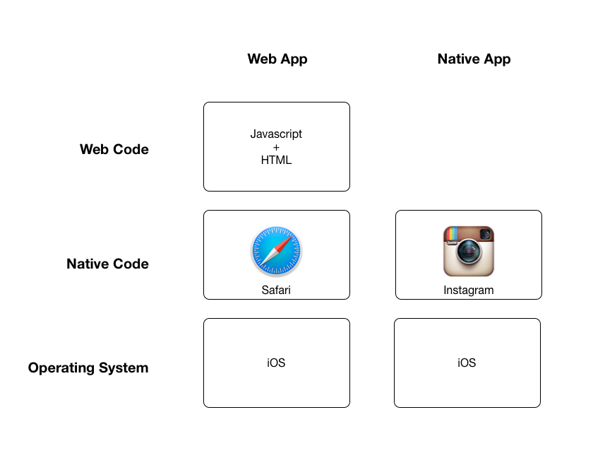
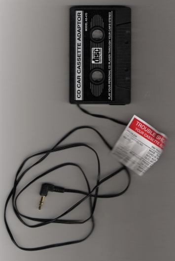
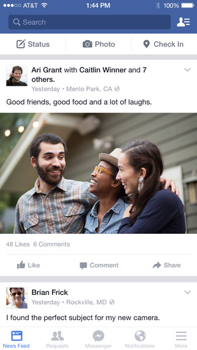

## Intro

A question I'm often asked is, "what's the difference between a mobile app and a web app?"

Essentially, the difference is that a web app runs inside of a web browser (Firefox, Chrome, Safari, etc), while a native app runs on its own, directly on the device's operating system.

Huh?

Essentially, web browsers are native apps that can browse the web and run lightweight apps inside of them.

Like a Matryoshka doll.

Let's take a look at the details to get more familiar with the underlying concepts.

For the sake of this article, we'll speak in terms of iOS, but I could have easily said "Android" or "Windows Phone" as the concepts are exactly the same. 

## Native App

In a native app, all the code in our app is running directly on the device, with full access of all of the features of the host operating system, in our case, iOS. 

Native apps on iOS are generally written in Objective-C or Swift.

## Web App

In a web app, you're no longer writing iOS code anymore. Instead, all the code that you write is Javascript and HTML, which must run inside of a web browser. 

But here's the interesting thing: a **web browser** is a **native app**!

### Cassette Adapter Metaphor

So, essentially, a web browser is like a cassette adapter! 

Indeed, the cassette player, iOS, only knows how to run native apps. In our metaphor, native apps need to have two spindles for rotating the tape and expose a magnetic strip where the sound can be read from. This is the "interface" that iOS is expecting from our app so that it can properly run it.

But if we want to play one of those newfangled Javascript-based web apps, which only works over a 3.5mm headphone jack, we're going to need an adapter to bridge between the two!

Hence, Safari / Chrome / Firefox, whichever web browser you prefer, is the cassette tape adapter; it IS a native app, but it allows us to run web apps.

### Piano Metaphor

Is that metaphor not working for you? Here's another one: you can think about this like a piano!

Writing **web code** for the browser is like writing music to be played **using the keys of a piano**.

Writing **native code** for iOS is more like **laying out the strings and the hammers**, oneself.

Thinking in terms of white and black keys representing musical notes is a much more **abstract**, human-friendly way of making music, but it *limits* us to the muscial notes that the piano designer has selected for us. And what if we want to creatively BEND our notes, like one would on a guitar? If we had access to the strings inside the piano, we might be able to do something like this, but since we've opted to play the piano instead of BUILD the piano, we're stuck with what the standard piano comes with. The good news is that the piano manufacturers (Mozilla, Apple, Google), are constantly tweaking and improving their pianos (Firefox, Safari, Chrome), so maybe it's not such a bad deal.

You can imagine that creating your own piano is going to be more work than writing the music to be played on it, but this gives us an unparalleled level of *control*. Want to arrange your strings and hammers in a new way? No problem. Want to change the underlying musical system that the strings are tuned to? No problem. Want to build a guitar instead of a piano? Hell, you have the materials -- lay them out how you wish!

Perhaps I'm torturing the metaphor, but I think that this illustrates the basic tradeoff of **control vs leverage**. Native app development is getting easier over time, but is likely to remain significantly more challenging than web app development for the forseesable future. Likewise, web apps are becoming richer and more full-featured, but they will likely always lag behind the potential of native apps.

## Hybrid Apps

The question, though, is can we have the best of both worlds?

I believe we can! These days, I generally advocate hybrid applications, where some of the code is dedicated to tuning and designing the piano (native code), while the rest of the code is dedicated to writing music to be played on its keys (web code). This, in theory, allows you to *split your human resources* so that some of the team to be operating at a **high level of abstraction**, getting a lot done with little work, while another part of the team is responsible for **ebuilding the innards**, making new keys for the others to play, as it were.

A better metaphor might be something like the electrical system in your household: most of us are happy to think in terms of our electric system as "This socket is on or off." An electrician, of course, might be concerned with voltage and current. A physicist, however, might be interested in electrons. You can see that the concerns in this system manifest differently depending on what "level of abstraction" we are working at.

## Abstraction

On abstraction, my general recommendation is to work at the *highest* level of abstraction that you can get away with. Most of us have better things to do than sit around and worry about whether we need a 32-bit or a 64-bit integer or when memory should be allocated and deallocated.

My favorite tools, though, are the ones that allow you to change your level of abstraction if need be. High, high, high, until you run into a roadblock and really need to zoom in and deal with the nitty-gritty details. This **flexibility** is incredible, because it provides the productivity of high abstraction with the control of low abstraction.

## Example

OK, so I've talked your ear off about web, mobile, and hybrid apps. But how about a real-world example?

Let's focus on Facebook, the #1 most-downloaded mobile app.

### Facebook Native App

Facebook, the native app, you download from the app store and launch it from the home screen.

### Facebook Web App

Facebook, the web app, you access by launching a web browser and going to facebook.com.

Sit down and play with each one for a few minutes and you'll notice the two of these are quite different in terms of look and feel, but still accomplish the same goal. This is a great example for illustrating the differences between web app and native app because the Facebook team has done an incredible job of building a web and a native version of their product.

## Conclusion

Now that we've seen the issue from all sides, where are we?

Web apps are generally easier to implement and maintain, but result in an inferior look and feel to native apps.

Native apps are dead sexy (it's likely that your favorite, slick app is a native one), but require a lot of love to implement and maintain.

Keep in mind these tradeoffs when you embark on an app strategy. In general, I would recommend people to **take a web app as far as they can** before moving to native, as many people RUSH towards a native app before they've fully sorted out their product concept, and pay the native code premium in terms of work and rework, when they could have been more **easily iterating on a web app**.

And what about hybrid apps? I argue that it's better to think of the world in terms of web vs native, because this will crystallize your priorities: *fast iteration and total coverage* versus *hand-crafted beauty*. Once you've **made your priorities clear**, you can figure out where on the spectrum you belong: *full velocity* with web, *full quality* with native, or somewhere in the middle with a hybrid approach.

Good luck with your app!

*Are you working on an app? Are you trying to select your tools? Let me know in the comments and let's talk about it.*
