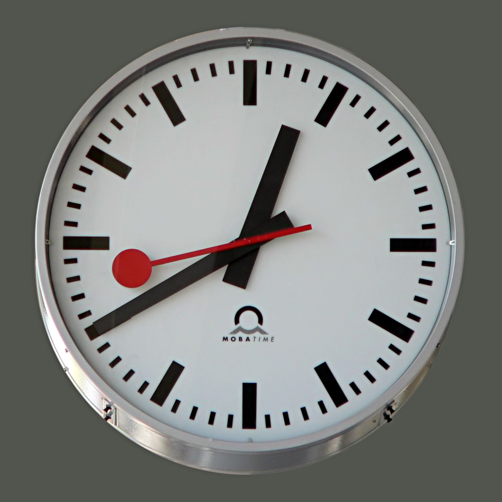

In a word: **no**.  

But damn does it come in handy!

Seriously, you can use whatever tools or paradigms that you like when you develop your app. If your entire team is a group of black-belt Java programmers and you couldn't be happier, great! Stick with what you have.

However, I think we've all come to that moment when we're at wit's end and dreading another 10 years of thread-safing our applications, rigging up a huge set of mocks and stubs to test our code, and, worst of all, starting to seeing more and more of our chosen programming language as dangerous or untestable (a la the "new" keyword in Java).

 *Java Joe feeling a bit over-extended by his favorite language.* 

Still, you may want to hear me out: I contend that there's a strong case to be made that functional programming is objectively better for driving down your bug count and improving your overall, long-term productivity.

Fighting words? Perhaps.

But I think we can all agree that the vast majority of programming bugs occur from misunderstandings around side effects (read: unchecked change of state).

 *SPJ: Tell me more about your problems with side effects.*  

> "All you can do without side effects is push a button and watch the box get hot." 

What if we could **eliminate** side effects *entirely*? Honestly, our applications wouldn't be good for very much. 
As Simon Peyton Jones likes to say, "All you can do without side effects is push a button and watch the box get hot." Indeed, we rely on change of state to perform nearly every task in a modern app.

But if we could somehow maintain all the *efficacy* of application state while dealing with it in a more **sane, maintainable** way? Then we'd be on to something.

Essentially, this is the promise of functional programming -- that we can still model complex application domains without having to invoke the ugliness of ACTUALLY dealing with state that could change at any time.

But how do we model this? Any useful UI needs to CHANGE. It can't stay completely static the whole time!

 
 

</a>

 *The clock: 99.998% less useful without change of state.*  

 [Photo](https://commons.wikimedia.org/wiki/File:BahnhofsuhrZuerich_RZ.jpg) by [JuergenG](https://de.wikipedia.org/wiki/Benutzer:JuergenG) / CC BY-SA 3.0 

And right you are. Indeed, our UIs do change, so the way we deal with this is through modelling our state as a [snapshot](https://en.wikipedia.org/wiki/Software_transactional_memory). And any time that our state changes, we're essentially creating a new snapshot of that application state. This may sound like six of one, half a dozen of the other, but it is, in fact, essentially different. The problem with most memory models, or ["Place-oriented programming"](http://www.infoq.com/presentations/Value-Values) as Rich Hickey likes to call it, is that there's no guarantee that we are all looking at the world's state in a unified way, no built-in guarantees that the objects we are working with won't change **as we are using them**. Thus, most applications end up putting an incredible amount of effort into coordinating state changes. Think about the overhead involved to maintain a sane, multi-threaded, object-oriented application at scale. 

No, not that **beautiful gem** that you wrote in the first week. I'm talking about the project that is a year in, and already *the joy is gone*. Rather than developing new functionality, you're spending all day working on exception handling. You can't ship the non-threadsafe version anymore because this time, you have paying customers and they're going to notice.

 

</a>

 *Passing a lock around between 47,000 people? Ain't nobody got time for that.*  

 [Photo](https://commons.wikimedia.org/wiki/File:SafecoFieldOF.jpg) by [Cacaphony](https://commons.wikimedia.org/wiki/User:Cacophony) / CC BY-SA 3.0 

Who to we have to blame for this? Essentially that our languages and tools grew up in a different time. A time when hardware was slow, expensive, memory-constrained, and single-threaded. All of those things have changed! And yet we're still passing around locks like it's 1999.

Rich Hickey gives the example of a baseball game, asking, when 30,000 people watch a baseball game together, do they each ask for access to a "lock" object in order to view the state of the game? No. That would be ludicrous. There must be a way for each of these people to observe the game independently from each other. Rich's answer for how we deal with this is exactly that same snapshotting system that I mentioned before. 

Think about this: would you rather build a wall with mud or stone? I make the argument that in [OOP](https://en.wikipedia.org/wiki/Object-oriented_programming), each element of building material is inherently more complicated because it houses its own state. 

What if you could make your fundamental building block simpler and less complex? Wouldn't that give you more confidence in your system, knowing that there are fewer variables and unknowns, no matter whether you're looking close-up at a given expression, or zooming out to look at a large chunk of the system at the same time?

 *Reactive Extensions: [FRP](https://en.wikipedia.org/wiki/Functional_reactive_programming) by Microsoft, one of the largest OOP shops in the world.* 

Do yourself a favor. Start with a small change. For your next web app, you can still use Javascript, but why don't you try using [React.js](https://facebook.github.io/react/) instead of Angular.js? For your next Android app, try using [RxJava](https://github.com/ReactiveX/RxAndroid) and see how you like it. For your next iOS app, why not incorporate [ReactiveCocoa](http://nshipster.com/reactivecocoa/)?

Did you enjoy that first baby step? Did it free you up to worry about other things? If so, why not take it one step further? Why not use [Clojurescript]() for a toy project? Why not experiment with [Elm](http://elm-lang.org/)? Heck, try building a game with [Arcadia](https://github.com/arcadia-unity/arcadia) or [play-clj](https://www.youtube.com/watch?v=0GzzFeS5cMc).

I know that there are a lot of holier-than-thou functional programming zealots out there, and my goal is not to be one of them. But I can't deny that they are on to something.
