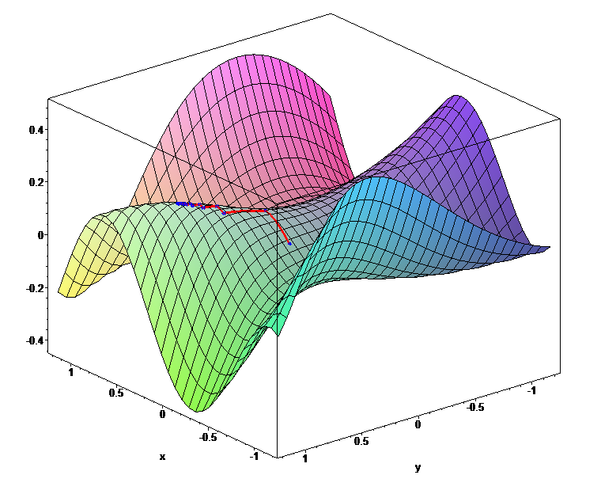

It seems like over the last few years, GPUs have completely transformed from gamer-centric graphics processors to general-purpose problem solvers.

Much of DeepMind AlphaGo's compute was done on GPUs.
Heck, much of the deep learning in GENERAL is done on GPUs.

But what's the big deal with GPUs? Why are they being used for other things than graphics?

Let's take a look at how and why they are changing the face of computing.

## Parallel

Working in technology, we're accustomed to the idea of Moore's Law. Every two years, our computers will get twice as fast. And this held true in a very straightforward way for many ears: we used to sit back and enjoy watching clock speeds scream higher and higher, but it looks like we're finally running into physical limits of how far that approach can take us, so we need to look elsewhere for a performance boost.

Intel's approach has been to throw more and more cores on a die, but there's a lot of overhead that goes into making this happen. An Intel CPU is an incredibly complex beast, and was originally designed as a single-core device. Multi-core is an idea that was added retroactively.

Meanwhile, GPUs are inherently parallel, consisting of many small, simple cores. The programming model and the hardware design, have always been based around many tiny co-processors acting together to solve a problem.

Moreover, due to the inherent simplicity of the architecture, we can allocate more of our transistors to compute rather than overhead! See the above diagram to appreciate this.

## Memory Bandwidth

Source: <a href="http://timdettmers.com/2014/08/14/which-gpu-for-deep-learning/"> Tim Dettmers </a>

Interestingly, the GPU's parallel design also gives it much higher memory bandwidth than contemporary CPUs.

The above chart displays GPUs vs CPUs from 2003 through 2013 and clearly demonstrates that GPUs score much higher on memory bandwidth.

This, is clearly a huge benefit, as the more data we can get in and out of a processor, the more computation that we can perform.

## Programming Model

The downside, as you might have guessed, is that the programming model is different.

In order to maximize the use of a GPU, you've got to break the work down into many small, parallelizable chunks.

Moreover, much of the code already out there presumes it's running on a CPU. And since the CPU is more closely tied to the rest of the hardware, it's very unlikely that we'll see Linux running entirely on a GPU anytime soon.

In short, CPUs aren't going away, and so for the forseeable future, we'll need to increase our comfort level with the new programming model of GPU computing.

## Success Stories

The good news is that several industries are already making great use of GPUs for computing.

Let's take a look at a few of them:

### Video Editing

Source: <a href="https://ca.wikipedia.org/wiki/Pitivi#/media/File:Pitivi_main_window.jpg">Jean-François Fortin Tam on Wikipedia</a>

Many video editing tasks are really just parallel image processing tasks, like [color balance](https://en.wikipedia.org/wiki/Color_balance). These tasks are incredibly parallel and a perfect fit for GPUs.

### Games

"Games? Isn't this obvious?"

Not so fast! Games have obviously been using GPUs for *graphics* acceleration, but did you know that many are using GPUs for *compute* as well?

Many modern physics engines such as [Bullet](http://bulletphysics.org/wordpress/) actually harness the GPU for accelerated physics computation.

### Scientific Computing

From computational chemistry to medical imaging and astrophysics, the raw computational power of GPUs are making supercomputing-like performance accessible to every lab. 

According to [this presentation](http://www.nvidia.com/content/GTC/documents/SC09_CUDA_luebke_Intro.pdf), some applications have seen speedups of 245x!
### Machine Learning

GPUs turn out to be an excellent hit in machine learning as well.

I'm not a machine learning expert, but I do know that many machine learning tasks involve a lot of matrix math, a natural fit for the architecture of a GPU.

If you're interested in this, you may want to check out [Facebook's AI server design](https://code.facebook.com/posts/1687861518126048/facebook-to-open-source-ai-hardware-design/), which includes 8 high-performance GPUs.

### The Frontier

What I'm particularly excited about is the potential to massively parallelize algorithms that we formerly assumed would run in `O(n)` or `O(n log n)`.

And it's starting to happen! Researchers have developed a [fast radix sort](http://mgarland.org/files/papers/gpusort-ipdps09.pdf) designed for GPUs. It doesn't run in constant time, but it does appear to be 20% better than the state of the art on the CPU. Not a bad starting point.

## Getting Started

Since GPU programming is a blind spot for me, I'm planning to dedicate some time on the side to become more familiar with GPU computing. In that vein, I picked up a copy of [CUDA by Example](http://amzn.to/1ULcXfl) from the local library. Why CUDA? I'd actually prefer to learn OpenCL for vendor neutrality, but the documentation and community around CUDA is firmly ahead of OpenCL right now.

Want to join me in my [learning journey](https://github.com/DavidYKay/learning-cuda)?

Here are a few links to helpful resources to get up and running with general-purpose GPU computing:

### CUDA

If you're interested in CUDA, here's a set of links to a [CUDA tutorial series from Dr. Dobb's Journal](https://llpanorama.wordpress.com/cuda-tutorial/).
Nvidia also has published a set of [high-quality slide decks](http://www.nvidia.com/object/SC09_Tutorial.html) to get you started.

### OpenCL

If you prefer the vendor-neutrality of OpenCL, here's [AMD's OpenCL tutorial](http://developer.amd.com/tools-and-sdks/opencl-zone/opencl-resources/introductory-tutorial-to-opencl/).

### Mobile

Android developers, will want to look at [RenderScript](https://developer.android.com/guide/topics/renderscript/compute.html) and iOS developers, will want to look at [Metal](https://developer.apple.com/metal/).

## Good Luck!

Good luck! Let me know how your journey goes. And chime in if you're already doing cool stuff with GPUs. I'd love to hear about it.
