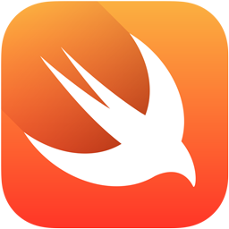

React Native is here and it's huge.

But is it the solution to all of our mobile dev problems?

Using ReactJS as a programming interface means that native app development is now accessible to a whole new audience: Javascript developers who are unfamiliar with iOS and Android.

Sound like a big audience? You bet!

The one issue that any React Native developer can tell you is that they almost always *run out of rope* with the Javascript APIs and find that they have to use native modules to get themselves out of trouble.

Ouch. We just **lost our major selling point** of not having to know Android and iOS!

In a world where every native module has been written and well-documented, this wouldn't be too much of a problem: just go on to [RNPM](https://github.com/rnpm/rnpm) and download a native module. Problem solved!

But nope, the current ecosystem is buggy and **immature**, and most problems haven't been solved the way YOUR app needs to solve them. Facebook claims that it's just a matter of time before everything is simply off-the-shelf, but I'm skeptical. I think there's a certain level of complexity that may require native bridging. For example, I still haven't seen a really good solution for *paginating thousands of rows* from a database (CoreData) into a ListView. Holler at me if you have.

To get back to our point, I suspect that for a long time, we'll see every major app developing its own native modules. Which means dependency on native developers and a breakdown of our lovely little Javascript bubble.

So, what other options do we have?

## Other Options

### RubyMotion

[RubyMotion](http://www.rubymotion.com/) is a great option, but it's proprietary.

If you have no beef with this, you should strongly consider RubyMotion.

### RoboVM

[RoboVM](https://robovm.com/) was an interesting attempt at solving the problem, but their choice of cross-compile Java to native code on iOS meant that there was no opportunity for interactive development as you couldn't deploy new bytecode at runtime. Also, since being acquired by Xamarin and now Microsoft, they've been completely shut down.

The project lives on in [BugVM](http://bugvm.com/), so you COULD still pick this approach, but my feeling is that there are better options out there (unless there are some killer JVM dependencies that you want to use on iOS).

### Swift / Rust / Other Native Code

There's been a lot of buzz lately about [Swift on Android](http://thenextweb.com/dd/2016/04/07/google-facebook-uber-swift/), but it's not viable right now. If you're building a game, sure, but not for run-of-the-mill application development.

You see, Google has deliberately kept the NDK very minimal to discourage developers from writing everything in C++. This is likely to keep all application code in DEX and thus hardware-portable. Hmm, sounds a lot like how Sun deliberately made JNI a pain in the butt to keep JVM code all in portable Java bytecode...

Still, Google has made some musings about officially supporting Swift on Android. To do so, they'll need to either:

**A.** Add a bunch of native APIs to bring the NDK up to parity with the SDK (unlikely as this runs against their philosophy and it would nearly double the framework surface-area they need to support)

**B.** Write a Swift to DEX compiler (A lot of work, but will lead to a trim & sleek result when all is said and done)

So, keep your eyes on the news. I suspect that we'll see a Swift->DEX compiler if Google is serious about this.

This is a big step-up from where we are right now, as Swift is a better language than Java and compiles faster than Kotlin.

However, my big beef with this is that Swift's dynamicity is limited, and the relative win over Kotlin-on-RoboVM is pretty minor, except that now we'll have a major corporate sponsor endorsing this approach. Not bad.

### Xamarin - C# / F\# / ...Clojure?

So what about [Xamarin](https://xamarin.com)? Despite its quality, I hadn't been taking it seriously because it was a closed toolchain, but, what Microsoft taketh away, Microsoft giveth:
after shutting down RoboVM, they announced the [plans to open-source](https://blog.xamarin.com/xamarin-for-all/) the entire Xamarin toolchain, which makes me entirely comfortable basing my business around their technology.

But which language to use? Most Xamarin users are on C#, which is a step up from Java, but not mind-blowingly so.

F# is a really neat language (descended from OCAML) and it does have a REPL! But I'm not sure it supports proper interactive development on Xamarin. I'll have to take another look at this.

I know I'm going to sound like a [SmugLispWeenie](http://c2.com/cgi/wiki?SmugLispWeenie), but, coming from the Clojure world, a big part of me would love to get Lisp/Clojure running on Xamarin.

It just so happens that Clojure has an implementation, that runs on the Common Language Runtime (ClojureCLR). 

Why would you want to build a ClojureCLR toolchain for Xamarin?

Well, let's look at the pros and cons of the best open-source option available, React Native.

## React Native

### Pros:

**Javascript** - Everybody knows it and is familiar with it. And you can compile Typescript/Clojurescript/etc to it.

**Supported by Facebook** - Having a big, influential, tech-forward corporation supporting/promoting a developer tool does a LOT for adoption and ongoing development.

**Huge mindshare** - ReactJS is the hottest thing on the block. React Native is appealing by association.

**"Reload" for fast development** - Ctrl-R to reload your code to see changes quickly is WAY better than doing a full compile-run-verify loop.

### Cons:

**Immature** - Despite the huge mindshare, there's a lot of rough edges in React Native.

**Doesn't have a complete MVC/MVVM solution just yet** - Last I used Redux, it was missing a few key pieces for building a real-world mobile app.

**Have to write a lot of bridge code** - Facebook says this issue will go away, but I'm skeptical. My guess is that large project will have to write some native code which will largely be duplicated on Android & iOS.

**Native code breaks flow** - When writing a native module, you can't just hit "refresh" to see your changes. You've got to compile and re-deploy the old-fashioned way.

**Javascript** - There are way better languages and runtimes than Javascript out there.

All-in-all, React Native is a pretty good option. Eliminating the compile step for the majority of cases and using a well-known UI framework are both really good ideas.

## ClojureCLR

Now why would I consider ClojureCLR on Xamarin to be a good idea?

### Pros:

**Every Native API** - ClojureCLR, via Xamarin, will be able to call into any and ALL of the native platform APIs. That's right: the team at Xamarin have completely bridged every framework in iOS and Android to the CLR. Very handy. Way better than breaking your interactive development flow and diving into "native code."

**Interactive development** - If you've never seen interactive development, you may want to take a second to watch [this video](https://youtu.be/KZjFVdU8VLI). It's a huge productivity boost, and it's a why React developers are so excited about hot module replacement. 

**Functional programming** - Smartphones and tablets are replacing desktops and laptops and thus are taking on more complex and mission-critical tasks over time. The advantages of functional programming are real and help in reining in the inevitable complexity of large systems.

**S-expressions** - Lisp source code is often shaped like the data that it describes: succinctness and intuitiveness emerge from this.

**Library ecosystem** - While the C# ecosystem is not as vibrant as Java's for server-side development, there are some truly world-class open-source libraries for Xamarin on Android and iOS. I'm frankly very excited at the prospect of building on top of ReactiveUI, which is arguably the best way to build native UIs on mobile.

## Cons:

**Startup time** - As mentioned, Clojure is not known for its fast launch times. We'll need to evaluate whether this will be a show-stopper.

**Idiomatic Libraries** - While we do have some great C# libraries to take advantage of, there aren't many (if any) idiomatic Clojure libraries available for Xamarin development. Getting off the ground will mean writing some idiomatic Clojure wrappers to make the process less intimidating.

**Developer familiarity** - Clojure still has a share of the global developer market, let alone the mobile app developer market.

If it works, this could be game-changing:

No-compile, **interactive development** with full access to all native APIs on both platforms, **Xamarin.Forms** for quick prototyping, and the powerful **ReactiveUI** framework gives us the flexibility to gradually move our screens over to fully-differentiated platform-specific code over time.

You can have your cake and eat it, too.

## Moving Forward

I'm going to attempt a proof-of-concept to see if this is feasible and see how bad the startup time is.

After writing this post for you, I'm now reading that the effort [may be impossible](http://stackoverflow.com/questions/16292598/can-i-use-my-own-dlls-with-my-xamarin-ios-and-android-projects), but I'm going to chat with some Xamarin engineers and figure out how this approach may or may not work.

If it does work, I'll be putting my work up in this [GitHub repo](https://github.com/DavidYKay/clojure-xamarin). Wish me luck!
