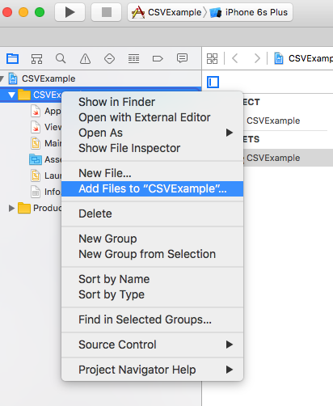

Are you working on one of your first iOS apps and eager to start pulling in CSV data from an external source? 

There's tons of CSV data available for every domain, but the docs on using it on iOS are a bit sparse.

Here's a quick guide on everything you need to know to get up and running.

Let's get started!

## Guide

### 1. Place your CSV file in the project folder.

Copy the CSV file into your **project folder**. This is the folder which contains your `.xcodeproj` file. 

**Protip:** I suggest creating a directory to keep your non-code assets organized. So, create a directory called `PROJECT_ROOT/Resources/Data` and copy your CSV file to `PROJECT_ROOT/Resources/Data/mydata.csv`.

### 2. Add your CSV file to the Xcode project.

Now that the file is in your project folder, you need to add it to your Xcode project.

**Right-click** the file browser in Xcode and use **"Add Files"** to make Xcode aware of your CSV file and bundle it with your app.

 
 

### 3. Install CHCSVParser

[CHCSVParser](https://github.com/davedelong/CHCSVParser) is a solid CSV parser library for iOS.

You can add it to your project however you like, but I suggest using [CocoaPods](https://cocoapods.org/).

If you've never used Cocoapods, it goes something like this:

* Close your Xcode project
* `sudo gem install cocoapods`
* `pod init`
* Edit `Podfile`, adding the line, `pod 'CHCSVParser', '2.1.0'`
* `pod install`
* Open the new `.xcworkspace`, NOT the `.xcodeproj` file
* Build and run

### 4. Use CHCSVParser to read in your data

Here are library author, Dave DeLong's, [instructions](http://stackoverflow.com/questions/6961367/basics-introduction-to-using-chcsvparser) for performing basic parsing:

~~~ objc
NSString *path = [[NSBundle mainBundle] pathForResource:@"Data" ofType:@"csv"];

NSError *error = nil;  
NSArray *rows = [NSArray arrayWithContentsOfCSVFile:path encoding:NSUTF8StringEncoding error:&error];  
if (rows == nil) {  
  //something went wrong; log the error and exit  
  NSLog(@"error parsing file: %@", error);  
  return;  
}  
~~~

So let's say your CSV file looks like this:

~~~ 
Barringer,Arizona,United States,Earth
"Chicxulub, Extinction Event Crater",,Mexico,Earth
Tycho,,,Moon
Lonar,Maharashtra,India,Earth
~~~

If you run it through the parser, the variable, `rows`, will now contain:

~~~ objc
[NSArray arrayWithObjects:
 [NSArray arrayWithObjects:@"Barringer",@"Arizona",@"United States",@"Earth",nil],
 [NSArray arrayWithObjects:@"Chicxulub, Extinction Event Crater",@"",@"Mexico",@"Earth",nil],
 [NSArray arrayWithObjects:@"Tycho",@"",@"",@"Moon",nil],
 [NSArray arrayWithObjects:@"Lonar",@"Maharashtra",@"India",@"Earth",nil],
 nil];
~~~

### 5. Render your data to the UI!

Now that you have your data, it's up to you to work with it and render it to the UI!

This step is outside the scope of the current post, but let me know if you need help with this part.

## Thanks

Learn a thing or two? If so, please sign up for my [newsletter](//newsletter) where I share helpful tips on mobile app development.

Still have questions? Please write them below in the comments!

------

*Inspiration for this post comes from Mandias09's [post](https://www.reddit.com/r/iOSProgramming/comments/4p1zyp/how_to_pull_outside_data_into_an_app/) on the iOS programming Reddit.*

