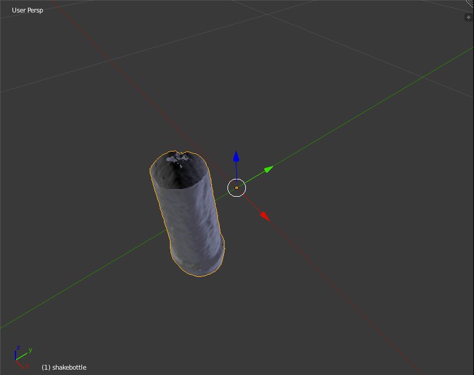

3D-scanning is incredibly cool, but there aren't a ton of resources out there on how to get up and running with it, especially with the Structure Sensor.

Although many have lauded 3D scanning for its ability to create assets for game development, one use case that goes overlooked is the ability to quickly measure real-world objects.

Whether you're scanning objects for 3D printing / rapid prototyping, medical measurement, or your own curiosity, we'll get you performing your first volume measurement in no time.

All you need is the Structure Sensor, an iPad, and a desktop computer, and you'll be able to measure the volume of nearly anything.

## Guide

We're going to perform this process in three steps:

1. **Scan** the object using the Structure Sensor Scanner App
2. **Email** yourself the .OBJ file
3. **Measure** the volume in Blender

Let's take a detailed look at all three:

### 1. Scan the Object

Scan it using the official [Structure Sensor Scanner app](https://itunes.apple.com/ca/app/scanner-structure-sensor-sample/id891169722?mt=8).

### 2. Email it to yourself

After you're done scanning, use the email button in top-right to send yourself an .OBJ file of the scan.

### 3. Calculate the Volume

Have some patience as this may be confusing on your first time.

#### 1. Install Blender

 
 

Install Blender, the open-source 3D editor. You can grab it from the [official download page](https://www.blender.org/download/). 

It's available for Win/Mac/Linux.

#### 2. Install the 3d Print Toolbox in Blender

Navigate to: `File > User Preferences`.

 
 

 <em>File > User Preferences</em>  

Click on the `Add-ons` tab.

Search for "3D Print" using the searchbox in top-left.

Check the box for the `3D Print Toolbox.` This will enable the 3D Print Toolbox add-on.

 
 

 <em>Enabling the 3D Print Toolbox Add-on</em>  

#### 3. Delete the blender cube

 
 

 <em>Cube-icide.</em>  

Now, right-click the cube sitting in your project and hit the "delete" key on your keyboard.

Click the `Delete` button in the confirmation dialogue.

#### 4. Import the scanned .OBJ file

Now that we have an empty project, let's import your scanned 3D model.

You can find it in: `File > Import > Wavefront (.obj)`

 
 

#### 5. Fill any holes in the object

Now that you have your 3D model in your project, you'll notice that there will be some holes in the model.

 
 

 <em>Yep, this thing won't hold water.</em>  

If we calculated the volume of the mesh in its current state, we'd get the wrong reading. So let's patch up the hole in it.

I find the **Remesh** feature to be useful for fixing this.

So, first click on the 3d model. Then go to the `modifiers` tab (wrench icon) in the properties panel. 

Select `Remesh`.

 
 

 <em> Select Remesh.  </em>  

For settings, I find I get the best results with `Octree Depth 8` and using `Smooth` mode.

 
 

 <em> Octree Depth 8 & Mode: Smooth.  </em>  

Once you have selected these settings, click `Apply.`

 
 

 <em> Apply.  </em>  

#### 6. Find the volume

 
 

 <em> Water-tight!  </em>  

With our model now hole-free, you should be able now calculate the volume accurately.

On the left-hand panel, you should be able to see a small tab marked `3D Printing` below `Tools,` `Create,` `Relation,` etc. Click `3D Printing.`

NOTE: If you can't see the left-hand panel that houses the `Tools` (rotate, scale, etc) and the `3D Printing Tools` (volume, area, etc.) you may need to click the `+` button in the main 3D view.

Once inside, make sure you have selected your 3D model by right-clicking on it, then click the `Volume` button at the top of the panel.

 
 

 <em> Volume Button.  </em>  

Now, scroll to the bottom of the panel and you should see the volume number listed both in Blender Units and in cubic centimeters.

 
 

 <em> Volume Display.  </em>  

## Thanks

Now you can measure the volume of anything! You'll be the envy of Archimedes in no time.

If this guide was helpful, please sign up for my [newsletter](/newsletter), where I share insight into mobile app development using 3d scanning.

Want a video version of this tutorial? Let me know in the comments!
