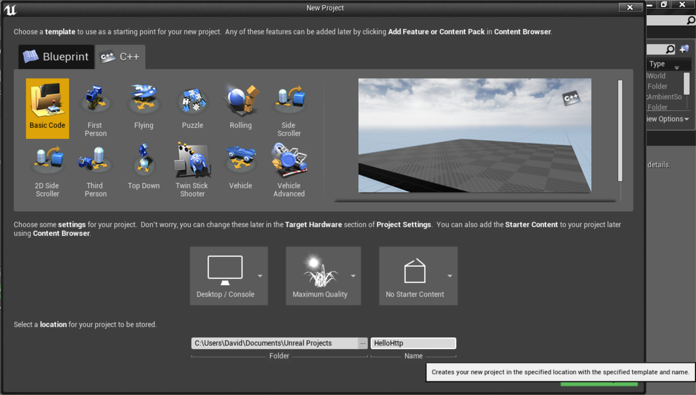
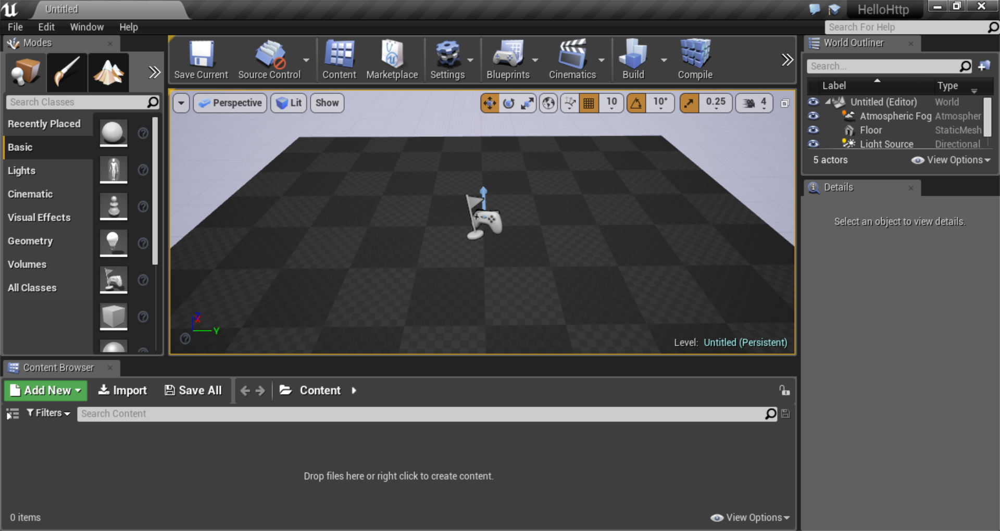
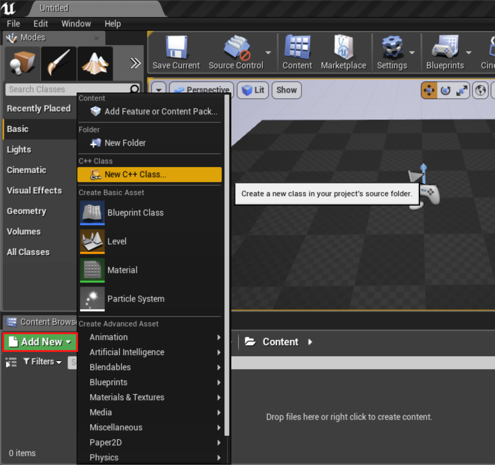
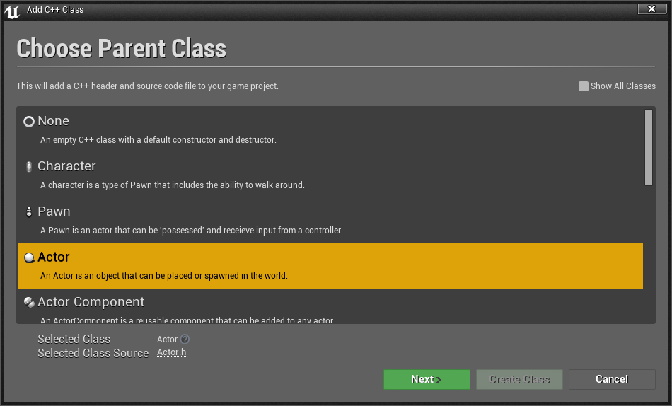
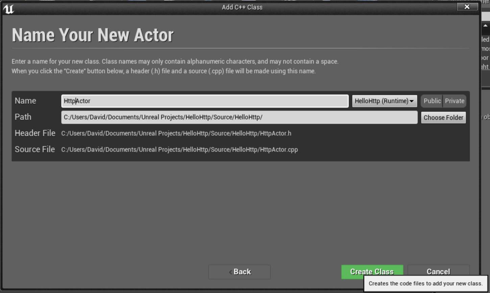
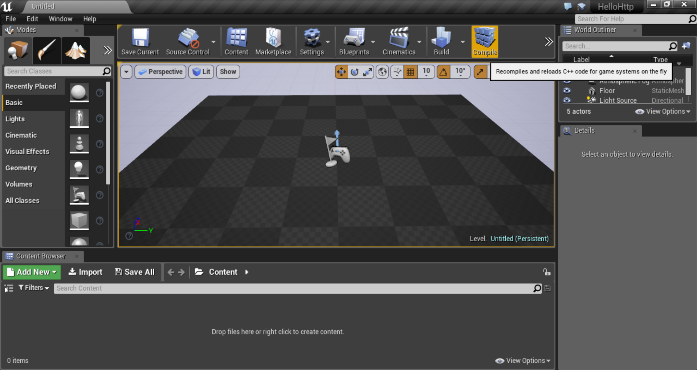
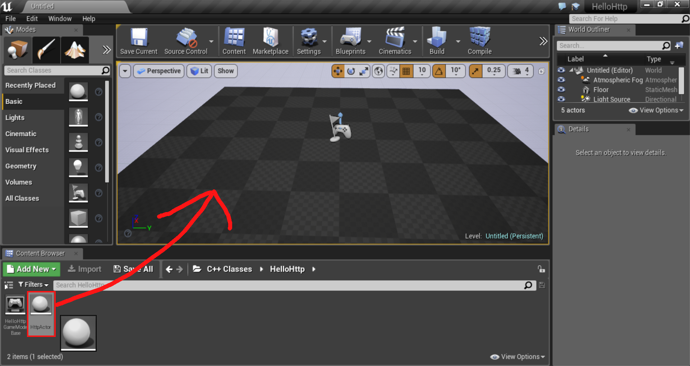
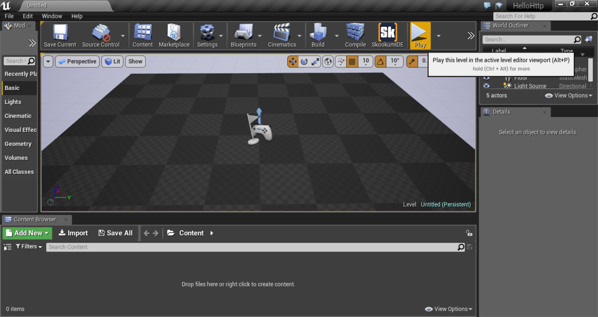
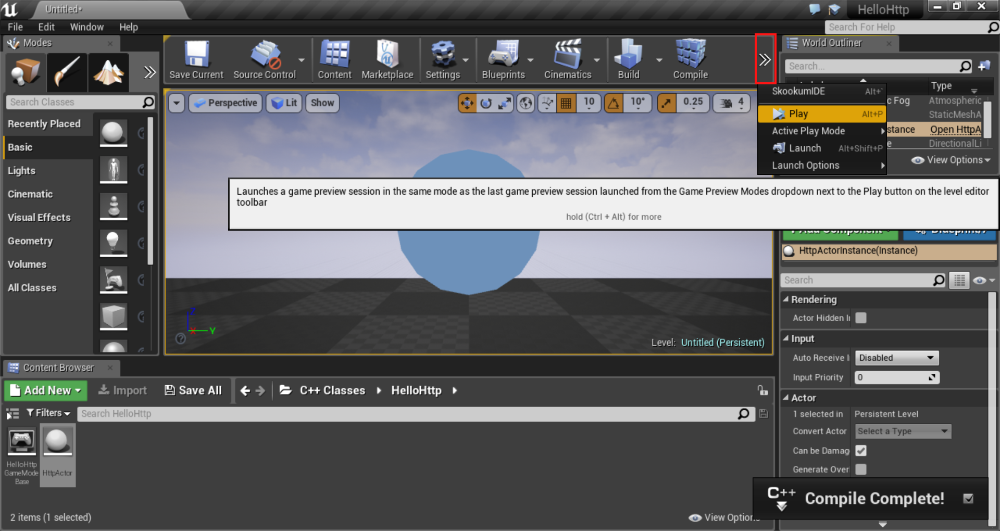
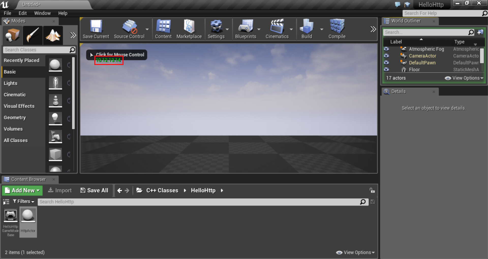

In VR development, it's incredibly handy to communicate with foreign computers. Modern software development is increasingly an exercise in "distributed systems," with many different computers sharing different parts of the workload, generally communicating with one another via HTTP.

In addition to its core rendering and gameplay features, Unreal Engine 4 sports mature support and documentation for synchronizing game state across multiple machines. 

However, in UE4, other forms of networking, such as HTTP, are less well-documented.
I'd go as far as to say that HTTP has not been considered a front-and-center technology in UE4. 
The documentation is sparse, and it seems that many developers don't take advantage of it.

If you're coming from web or mobile development, this may be shocking, as you may think of making HTTP calls as an everyday activity. 

If you're new to HTTP and you're looking to offload some intelligence to web services or stream in your assets at runtime, HTTP could be just the missing piece you need.

So, let's make our first HTTP call. I'm presuming you have some familiarity with code, but no black belt is required.

## Creating the Project

### New Project

After launching the UE4 editor, create a new project. You want the **C++ > Basic Code** template. 

In this example, I'm creating a project with *No Starter Content*. You can use the starter content. The biggest difference is that you will have two chairs and a table instead of a completely empty room, like in my project.

Name your project **"HelloHttp"**

### Welcome to Blank Project

We now have a blank project.

### New Class

To write our code, we must first create a class to contain our code.

Click the green **"Add New"** button in the bottom left, then select **"New C++ class."**

### Actor

Select **"Actor"** as the Parent Class.

`Actor` is the parent class for all interactable objects in UE4: Players, NPCs, switches, and pickups, for example, are all children of `Actor`.

### Name

Name your actor **"HttpActor"** and click **"Create Class."**

## Writing the Code

Now it's time to write the C++ code that will execute our HTTP call.

Most people use Visual Studio for this part, but you can use any text editor, such as Vim, Emacs, or Atom, to write the code. The Unreal Editor itself actually performs the final compilation, so Visual Studio is not necessary.

Still, if you're working on Windows, Visual Studio is a good default option as its auto-complete and code analysis tools are very strong.

### Adding the Modules to the project

First, we need to tell UE4 that we require the Http, Json, and JsonUtilities modules. 

We do this by editing a C# file which provides UE4 some instructions on how we'd like our project to be compiled.

Use Visual Studio or your favorite text editor to **open `HelloHttp/Source/HelloHttp/HelloHttp.Build.cs`**.

Now, find line 9, which looks like this:

~~~ c#
PublicDependencyModuleNames.AddRange(new string[] { "Core", "CoreUObject", "Engine", "InputCore" });
~~~

And **add the Http, Json, and JsonUtilities modules**:

~~~ c#
PublicDependencyModuleNames.AddRange(new string[] { "Core", "CoreUObject", "Engine", "InputCore", "Http", "Json", "JsonUtilities" });
~~~

This lets UE4 know to link the Http, Json, and JsonUtilities modules to our project at compile time.

### HttpActor.h

Next, we need to import the Http module and declare our new fields and methods for performing our Http call.

You can simply **paste this into `HelloActor.h`**, replacing the old contents:

~~~ cpp
#pragma once

#include "GameFramework/Actor.h"
#include "Runtime/Online/HTTP/Public/Http.h"
#include "HttpActor.generated.h"

UCLASS()
class HELLOHTTP_API AHttpActor : public AActor
{
	GENERATED_BODY()

public:
	FHttpModule* Http;

	/* The actual HTTP call */
	UFUNCTION()
	void MyHttpCall();

	/*Assign this function to call when the GET request processes sucessfully*/
	void OnResponseReceived(FHttpRequestPtr Request, FHttpResponsePtr Response, bool bWasSuccessful);

	// Sets default values for this actor's properties
	AHttpActor();

	// Called when the game starts or when spawned
	virtual void BeginPlay() override;
};
~~~

Above, we created a new field, `Http`, which contains an instance of `FHttpModule`, as well as declaring two methods, `MyHttpCall()`, and `OnResponseReceived()`.

### HttpActor.cpp

You can simply **paste this into `HelloActor.cpp`**, replacing the old contents:

~~~ cpp
#include "HelloHttp.h"
#include "HttpActor.h"

// Sets default values
AHttpActor::AHttpActor()
{
	//When the object is constructed, Get the HTTP module
	Http = &FHttpModule::Get();
}

// Called when the game starts or when spawned
void AHttpActor::BeginPlay()
{
	MyHttpCall();
	Super::BeginPlay();
}

/*Http call*/
void AHttpActor::MyHttpCall()
{
	TSharedRef<IHttpRequest> Request = Http->CreateRequest();
	Request->OnProcessRequestComplete().BindUObject(this, &AHttpActor::OnResponseReceived);
	//This is the url on which to process the request
	Request->SetURL("http://localhost:8081/WebApi/getint.php");
	Request->SetVerb("GET");
	Request->SetHeader(TEXT("User-Agent"), "X-UnrealEngine-Agent");
	Request->SetHeader("Content-Type", TEXT("application/json"));
	Request->ProcessRequest();
}

/*Assigned function on successfull http call*/
void AHttpActor::OnResponseReceived(FHttpRequestPtr Request, FHttpResponsePtr Response, bool bWasSuccessful)
{
	//Create a pointer to hold the json serialized data
	TSharedPtr<FJsonObject> JsonObject;

	//Create a reader pointer to read the json data
	TSharedRef<TJsonReader<>> Reader = TJsonReaderFactory<>::Create(Response->GetContentAsString());

	//Deserialize the json data given Reader and the actual object to deserialize
	if (FJsonSerializer::Deserialize(Reader, JsonObject))
	{
		//Get the value of the json object by field name
		int32 recievedInt = JsonObject->GetIntegerField("customInt");

		//Output it to the engine
		GEngine->AddOnScreenDebugMessage(1, 2.0f, FColor::Green, FString::FromInt(recievedInt));
	}
}
~~~

Here, the bulk of the code went into the implementation for `MyHttpCall()` and `OnResponseReceived()`, but we also got an instance of `FHttpModule` in the constructor and called `MyHttpCall()` in the UE4 actor lifecycle event, `BeginPlay()`.

### Compile

Now that we've written the code, we need to compile it.

Do so by clicking the **Compile button** in UE4.

### Add to Scene

Now that you have written the code for `HttpActor`, you'll need to add an instance of `HttpActor` to your scene.

Do so by **clicking and dragging** it from the Content Browser to the Viewport.

Place it anywhere in your scene as its position in the game world doesn't matter.

### Play

We're all set. It's time to run the code. Click the **"Play" button** on the toolbar. You can also hit Alt-P.

If the play button is not visible, you may need to click the ">>" button on the far right side of the toolbar, as pictured below:

### Done

You should now see your public IP address appear, using a green font, in the top-left corner of the screen.

Congrats! You have written your first HTTP call in UE4.

## Wrap

From here, you may want to modify your code to perform POSTs or to work with an internal REST API you may have developed.

What did you think? Hopefully now you're fully prepped add that killer network feature you've been planning.

Also, I have some questions for you:

Are you more of a Blueprints user? In a future article, I can show you how to perform HTTP calls without using any C++. Just say so in the comments.

Are you more interested in learning how to build server-side systems for your VR application/game? Let me know and I can write an article about getting started with server-side development.

Or, perhaps you just want to tell me what you're working on? Say so in the comments below.

Until next time.

P.S. A huge kudos to OzoneBG on the Unreal Engine wiki for writing the [code sample](https://wiki.unrealengine.com/UE4.10_How_To_Make_HTTP_GET_Request_in_C%2B%2B) that formed the basis for this article.
