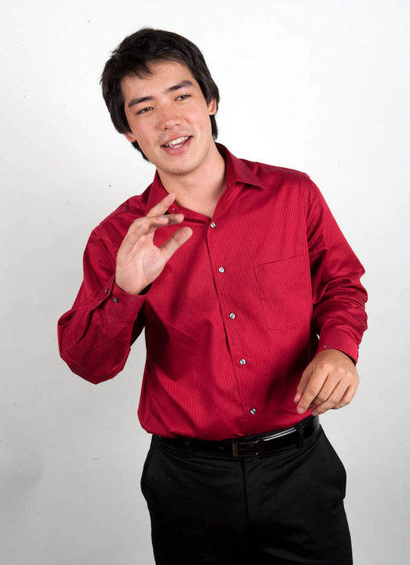

Dear friends, I'm at a major fork in the road: 

On the one hand, Apple is offering me a very nice package to work on Siri down in Silicon Valley. This would be a great opportunity to live in Silicon Valley and meet some of the best and brightest in the industry.

On the other hand, I know that my long-term destiny is not to be a salaried employee. Apple would be a stepping stone to something greater.

The question is: if it's not aligned with my long-term goals, why take the job? Why not choose a path that better develops the skills that I plan to use in the long term? Such as entrepreneurship and comfort with uncertainty?

Some background for you guys:

Until this Christmas, I had lived 29 years of my life completely without a sense of self-esteem.

I've always thought that I was not smart, good-looking, hard-working, fit, or talented. My thoughts during every hour of every day would inevitably gravitate towards the negative. 

This came to a crescendo last Christmas, when I was so overcome with anxiety that I could not put my hands on the keyboard in order to get work done. As you'll hear in a later post, I took drastic actions that have helped to turn my life around since that point.

However, I recently had a major career failure that had me questioning my own competence once again. However, after looking back at all of my failures in life, I realized that the root cause of every single one was a deep sense of anxiety and lack of self-worth. In each case, if I'd had seen myself as a human being deserving of respect, rather than a worthless waste of life, I would have not made the compounding mistakes that ultimately ended up in failure.

Indeed, through interviewing in Silicon Valley, I've confirmed that my technical skills are fine. I scored in the top 0.036% of all candidates on the Triplebyte software engineering test, received many job offers, and, when I'm rejected by an employer, it's usually for "culture fit" reasons rather than technical ones.

So, where does this leave us? I know my destiny is to build a successful software business, but I've always felt that I'm "not smart enough" or that I need to learn "one more thing" before I'm truly ready. The data demonstrates otherwise. 

Apparently, the only thing left to battle is my own psychology.

I've lived most of my life dominated by a kind of an animal fear. When I think of launching a product, I am often paralyzed by the thoughts of: what if I fail? What if nobody buys the product? What if I end up homeless? What if my father is ashamed of me?

Honestly, it's the last one that frightens me the most.

In this moment, gripped by the fear of uncertainty, I seek clarity and ask myself: how can I be most useful? How can I create the most value for the world? How can I be my truest self, every day, performing my best work in service of the Singularity, standing for the ultimate unlocking of human potential?

Working at Apple, though a dream job for some, is not my answer to that question.

If I'm unable to come up with another revenue stream before the job offer explodes, I may have to take the job. But that is not my first choice.

I've worked through most of my career NOT living up to my potential and NOT doing my best work. I'm ashamed to admit this, but it's the truth.

Those who are close to me have caught glimpses of what I can achieve and I must admit that I've done a poor job of creating the proper environment in my day-to-day to unleash this potential.

Life is short. Why settle for anything less than being your absolute best? Why deprive the world from the incredible work that is deep within you, looking to escape?

For many, the answer is simple: fear! 

"What if I fail?" too often becomes a mantra, the manifestation of Freud's Death Drive, slowly killing dreams from within.

Failure is subconsciously tied to the thought of being without food and shelter. We can't help it! Maslow's hierarchy drives us. Once upon a time, these were adaptive instincts.

However, if we are to become truly great, unleashing our frightening potential on the world, we must go beyond our animal instincts of scarcity and survival, staring death in the face.

Friends have called me "fearless," but they don't know the agony that I've lived for 29 years of looking in the mirror and seeing a failure. They don't know that the thought of failure calls up painful childhood memories and sends a tingle between my shoulder blades.

Am I ready to move beyond this?

Seven years ago, I had a photo reading done by a [man I deeply look up to](http://www.petermichaud.com/).  

I sent him this photo:

He wrote back that if I wanted to become a tech entrepreneur, I needed to gain the inner confidence to become fully self-expressed.

He said that "Steve Jobs was so sure of himself, he could stare the rust off of a truck."

Call me cheesy, but I think I'm finally ready. 

Wish me luck.
