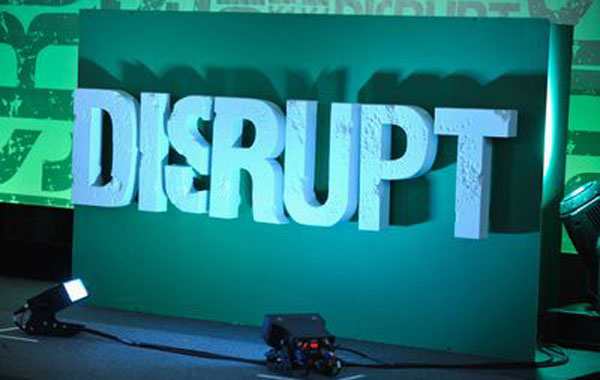

[Legacy systems][1] are all around us. For the sake of this post, let's call a legacy system that would have been designed in a different way had it been designed today.

Given the rate of advancement in technology, systems are becoming "legacy" at a faster and faster rate. Some go so far as to say that systems are "legacy" the day they are launched!

The question is: what to do about these legacy systems? Do we kill them and replace them with the new and shiny? Do we gradually evolve them? Or do we embrace their imperfection and leave them in a state of status quo?

## The Silicon Valley Approach

What I find fascinating is that Silicon Valley is obsessed with discarding the old and "disrupting" it with the new.  

    
     
    <a href="http://www.getthefive.com/articles/the-marketeer/my-techcrunch-disrupt-pr-experience/">TC Disrupt</a>

For startups, I'd argue that the core reason is **financial**: many founders hope to **"disrupt"** and displace an incumbent, taking away its market share. This appetite for disruption and glory is a great motivator to build a new, competing system rather than to work harmoniously with the old one.

Money and entrepreneurs aside, technologists also have a hard time resisting the siren song of "greenfield development." Building a new system rather than improving an old one is generally considered more exciting -- why live with someone else's mistakes and old technology when you can "do a better job" and try out the latest and greatest tools?

However, I'd argue that there's a strong precedent for working **WITH** legacy systems, building on top of them rather than throwing them away. Moreover, it turns out that legacy systems are not unique to the technological domain; "legacy systems" seem to be a fundamental part of biology and civilization.

Let's first look at biology and then technology before we examine how working with legacy systems could be a great thing.

## Biology

Indeed, the concept of a "legacy system" occurs again and again in nature.

An imperfect illustration of this can be found when looking at the development of embryos:

![Drawings of embryo in progressive stages of development][3]

Although it's been disproven that "[ontogeny recapitulates phylogeny][2]," this illustration reminds us that we are carrying a genetic payload that dates back millions of years. Many of our biological processes are actually quite similar to that of a rat or a dog. **Why bother reinventing the wheel** when it seems to be doing its job? It'd be incredibly energy-intensive to get it right, so it seems that nature likes to work with what it *already has*.

### The Human eye

One of my favorite examples of "good enough" in evolution is the human eye, as it is simultaneously a great marvel of evolution and a grossly inefficient system.

Armed with 100 million photoreceptors, it grants us with an incredible ability to perceive the world around us, from minute, proximate details to distant landscapes.

However, it has many flaws, my favorite being the infamous **[blind spot][9]** due to the unfortunate location of the optic nerve.

Evolution apparently decided that it was "good enough" to have a hole in the center of our vision and it was time to expend energy elsewhere!

### Limbic System

The [limbic system][10] is a set of structures which compose the animal, fight-or-flight instincts of the brain which evolved much earlier than the pre-frontal cortex, the area of the brain most strongly associated with the power of abstract thought.

Recently, there's been some criticism about whether the borders of limbic system are still accurate, but I think that the point is still valid: we are carrying around thought patterns that date back far beyond the dawn of modern society, and these animal sometimes lead us astray. 

What's the solution? Do we selectively deaden parts of the brain, performing a high-precision lobotomy? Seems very costly to me. For now, most of us are stuck with our animal instincts, wielding tools like [meditation][11] and [spirituality][12] to better work with them.

## Technology

### QWERTY keyboard

The QWERTY keyboard that we know so well is a great example of this. The keyboard was designed to keep English-language letter pairs as far apart, left-right, as possible. Why? Because if you touch two keys that are too close to one another, let's say "OK" on a QWERTY keyboard, there's a chance that the "O" hammer will catch the "K" hammer and you'll have to unjam your typewriter.

So the QWERTY keyboard is designed to be the fastest keyboard given the constraints of a typewriter. Those constraints have melted, but most of us have accepted that QWERTY is "good enough" and moved on.

(For the purists, there are alternative [keyboard][6] [layouts][7] that try to solve this problem.)

### UNIX

UNIX, the most successful operating system ever, which powers our smartphones and most of the Internet, is constantly under fire as being stuck in the 1970s.

> We really are using a 1970s era operating system well past its sell-by date... let's face it, the fundamental design of Unix is older than many of the readers of Slashdot, while lots of different, great ideas about computing and networks have been developed in the last 30 years.   
> -Rob Pike (in 2005)

Rob Pike led an effort to develop an OS known as [Plan 9][8], which was an attempt to build a network-first, Internet-first operating system. Plan 9's ideas were revolutionary, but the project was canned by Bell Labs and Plan 9 never took off.

These days, rather expend energy constructing an all-new, network-first operating system, the software industry is hard at work building new layers that work **on top of UNIX**, embracing its warts and wrinkles.

If you've ever heard of technologies like CoreOS, Apache Mezos, or IPFS, these and many more are taking the accretive strategy of working with the existing legacy systems, rather the audacious "throw them out" ideology of Plan 9.

### PSTN

[PSTN][13] is the formal name for the conventional telephone network: jack in, get a dialtone, make a phone call.

In this era of IP-based telephony, you'd think that PSTN would be long-dead, but not so! PSTN still powers a staggering number of voice calls around the world, even though the telecoms of the world are busy at work making sure that everything moves to packet-based networking over modern fiberoptic connections.

## What if?

So, we've taken a brief look at how other biological and technological systems are thriving through an accretive, pro-legacy system approach.

But what's the answer?

I'm still formulating the __answer__, but I think this is the **question**:

What if we could work more gracefully with legacy systems? 

What if we had a way to expertly abstract away the wrinkles and warts of the past, exposing a clean interface that future generations could build upon?

The human body didn't evolve overnight, and it wasn't designed/developed by one entity. It was a collaborative effort over millions of years. 

To think that the computing systems of tomorrow will be developed and designed centrally is egotistical and short-sighted. 

What we need is a graceful way of embracing these systems and keeping them relevant and useful as the state of the art marches ever forward.

Now, **that** is a project worth undertaking.

[1]: https://en.wikipedia.org/wiki/Legacy_system "Legacy System"
[2]: https://en.wikipedia.org/wiki/Recapitulation_theory "Recapitulation Theory"
[3]: https://upload.wikimedia.org/wikipedia/commons/0/08/Haeckel_drawings.jpg "Haeckel drawings"
[4]: https://en.wikipedia.org/wiki/Sabre_(computer_system) "Sabre (computer system)"
[5]: https://en.wikipedia.org/wiki/Appendix_(anatomy)#Maintaining_gut_flora "Human Appendix & Gut Flora"
[6]: https://en.wikipedia.org/wiki/Dvorak_Simplified_Keyboard "Dvorak Keyboard Layout"
[7]: https://colemak.com/ "Colemak Keyboard Layout"
[8]: https://en.wikipedia.org/wiki/Plan_9_from_Bell_Labs "Plan 9 (OS)"
[9]: https://en.wikipedia.org/wiki/Blind_spot_%28vision%29 "Blind Spot (vision)"
[10]: https://en.wikipedia.org/wiki/Limbic_system "Limbic system"
[11]: /Getting-Started-with-Meditation/ "Getting Started with Meditation"
[12]: /The-Importance-of-Spirituality/ "The Importance of Spirituality"
[13]: https://en.wikipedia.org/wiki/Public_switched_telephone_network "PSTN"
[14]: http://www.getthefive.com/articles/the-marketeer/my-techcrunch-disrupt-pr-experience/ "Photo Source"
[15]: ../images/2017/06/EmbracingLegacySystems/tc-disrupt.jpg "TC Disrupt"

