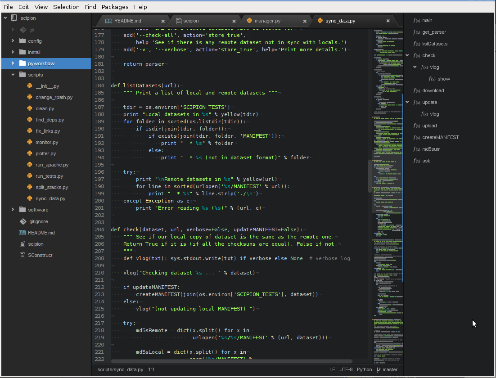
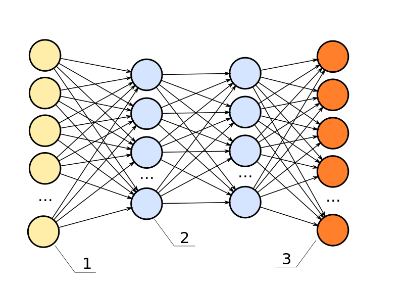
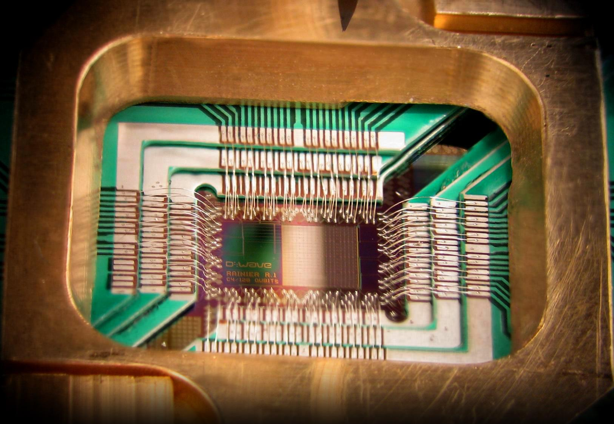
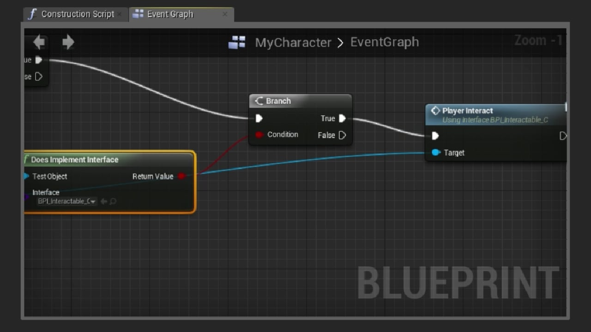
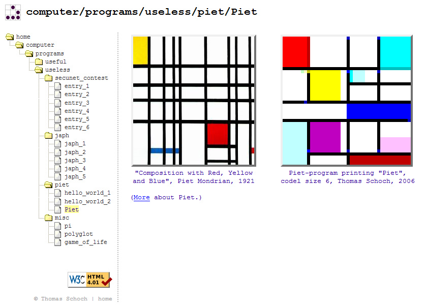
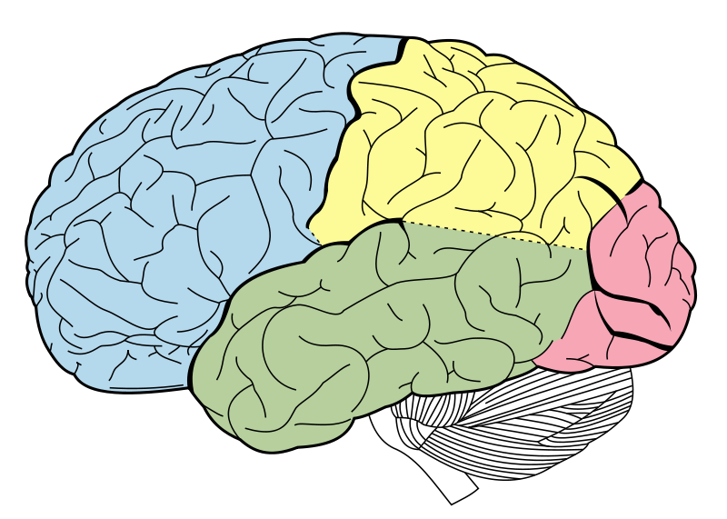

My fellow programmers,

I've been thinking about the **future of our industry** and wanted to share my thoughts with you. 

My hope is that you leave this post with new ideas on what we have to **look forward to** and how we might get there.

## The Past

But, before we look forward, we must take a moment to look back.

In our field, we don't often pay much attention to the work of those who have come before us.

Our field is built on many incredible ideas, including the infamous [Turing Machine][18] and [Lambda Calculus][19].

Though the early tools were primitive, our forefathers performed incredible work using nothing more than mechanical switches and punchcards.

    
     
    <a href="https://commons.wikimedia.org/wiki/File:FortranCardPROJ039.agr.jpg">Source: Arnold Reinhold</a>

## The State of Affairs

Fast-forward to the modern day and we have the incredible luxury of working with digital displays, digital storage, human-readable text, and robust interpreters and compilers.

    
     
    <a href="https://commons.wikimedia.org/wiki/File:Atom-editor.png">Source: Jordi Burguet-Castell</a>

For all of Javascript's faults, it's amazing that [Stanford's intro to CS is now using][1] a language with first-class functions, garbage collection, a performant interpreter, and a colossal install base.

For most of us, the days of assembly code are a distant memory, and it seems that year by year, we march further from the obsession with the Turing machine. C and C++ are increasingly relegated to niche usage and many young programmers now regard Java as "low-level!"

Steve Yegge has written an [incredible treatise][16] on abstraction and when it's OK to treat the underlying substrate as pure black magic.

Some choice quotes:

> As of today, anyway, I don't believe the JVM is allowed to be on the "it's magic" side of the line.  
> -Steve Yegge

> As the Line of Acceptable Magic moves up each year, the people who understand abstractions below the line will kick and scream (I do it too), saying that back in the old days, your bits had to walk uphill both ways in the snow.  
> -Steve Yegge

When I see Javascript as the de facto standard language, I begin to pine for the good old days!

However, sitting around and bellyaching is not useful. What's useful is looking forward.

## What's Next?

So, **what's next in programming?**

Clearly, the bar of abstraction continues to rise. And we owe this abstraction for the incredible productivity we enjoy day-to-day.

Going forward, I'll still beat the *functional programming* drum, but it seems to me that that war has become a foregone conclusion and it's time to look for a new battleground.

Let's take a survey of the areas that could give rise to the **next programming revolution**:

### Data-driven Systems / AI

The ability of modern neural networks to map a complex function is [nothing short][6] of [incredible][7].

    

It's easy to look at a wide range of programming tasks and think to oneself: "Gee, that'd be a great opportunity to use machine learning / AI!"

Could we take this so far as to think that AI could **replace all human programmers**? One day, probably. There's a compelling [argument][17] that, one day, computers will give rise to consciousness. Once that's happened, it's quite hard to predict where things will go.

However, I suspect that for a while (ten years? twenty?), AI will only be strong enough to implement the nuts & bolts of a system. We will still need other tools to design the top-level.

### Quantum Computing

Quantum computers are very much a real thing. D-Wave Systems, in Burnaby, BC, has built a successful business around manufacturing real-life quantum computers.

    
     
    <a href="https://commons.wikimedia.org/wiki/File:DWave_128chip.jpg">Source: D-Wave Systems, Inc.</a>

Google, IBM, and very likely other tech giants are also working on developing quantum computers in-house. Google, for example, has the ambitious goal of ["quantum supremacy" by year's end][5]. In essence, they are looking to solve a problem using a quantum computer that would be unsolvable in a reasonable amount of time using a conventional computer.

Quantum computing, at least so far, is not suitable for general-purpose programming, but there are some who believe that will change. It's hard to say what the future holds, but I suspect that for the next ten years, we'll see the quantum computer as a coprocessor, similar to a modern GPU or a 1980s FPU.

This is not to understate the importance of a "QPU" or "Quantum Processing Unit." QPUs will likely break most modern cryptographic systems and drastically accelerate machine learning training tasks. I'm sure we'll find **many** more uses for this technology as more people become familiar with this new computing paradigm.

### Visual Programming

Visual programming is, in my opinion, one of the most overlooked areas where a programming revolution could occur.

    
     
    <a href="https://vimeo.com/111146950">Source: Pluralsight Creative / Digitaltutors.com</a>

At minimum, I suspect that visual programming could be the **arquebus** while textual programming remains the *longbow*. That is, while textual programming may be a more precise tool, visual programming could open up software development to many people who are otherwise intimidated by both the toolchain and languages of conventional textual programming.

While visual programming hasn't enjoyed mainstream adoption thus far, it's made some inroads in various niches. 

Some of the foremost success stories of visual programming:

* [Max/MSP][9] - Music/multimedia language used for recording, performance, and art installations.
* [LabVIEW][10] - Often used for robotics, NASA is [a][11] [big][12] [fan][13].
* [UE4 Blueprints][14] - The default scripting language for Unreal Engine 4 is completely visual!

[Piet][15] (named after Mondrian) deserves special mention. Practicality is not its top priority, but a well-designed Piet program is, quite literally, a work of art.

    
     
    <a href="https://www.flickr.com/photos/caseorganic/5046004497">Source: Amber Case</a>

With the advent of **virtual reality**, I suspect that visual programming is going to heat up *significantly* over the next ten years. 

Imagine designing a computing system in three dimensions, using your hands, and watching the data flow like water. One step closer to Gibson's vision of cyberspace...

### Brain-computer Interface

Science-fiction? Not for long.

    
     
    <a href="https://commons.wikimedia.org/wiki/File:Lobes_of_the_brain_NL.svg">Source: Henry Gray, Henry Vandyke Carter</a>

[Cochlear][23] and [retinal][22] implants are both available on the market today, so there is a certain amount of **neural input** that we are capable of.

Likewise, [neural headsets][24] have been available to consumers for several years now at very affordable prices. We have much ground to cover, but there have been decades of research into **neural output**.

[Neuralink][25] and [Kernel][26] are bold attempts to develop and commercialize neural augmentation systems for humans that are already funded and underway, today.

With a much **higher-bandwidth** connection to the computer, I suspect that Emacs and Vi will no longer be the most effective tools for writing code.

The good news: this one's a way off. Even after the R&D risks, regulatory approval is going to be a nightmare on this one. I actually wouldn't be surprised if we see these developed and tested over in Asia where the healthcare laws are much looser than in North America.

### Milking the Last of Conventional Computing

To think that we have total mastery of conventional computing is an error.

If we ignore new innovations for a moment, even spreading better techniques among the programming population, can greatly improve our productivity globally.

The popularity of ReactJS has done wonders for the spreading of functional programming concepts in recent years. In the same vein, [Figwheel][28]'s innovation of live development has spread like [wildfire][29], finally bringing Bret Victor's [vision][27] to life.

Still, I think our work is not yet done.

This quote illustrates, I think, how programming with the right tools can be a truly sublime experience:

> You can reach a point with Lisp where, between the conceptual simplicity, the large libraries, and the customization of macros, you are able to write only code that matters. And, once there, you are able to achieve a very high degree of focus, such as you would when playing Go, or playing a musical instrument, or meditating. And then, as with those activities, there can be a feeling of elation that accompanies that mental state of focus.  
> -Rich Hickey

So, when you experience some [yak shaving][30], ask yourself how you might be able to make that process incrementally better for the next guy. (Who is likely yourself!)

I laud efforts such as [Higher-Order Perl][4], especially for its time, as it expertly bridges the gap between imperative programmers and functional techniques. Resources like this help us to spread the good word and raise the median.

I haven't even mentioned programming language research or other similar topics because I really wanted to drive home the idea of making the most of what we have right now. Let's leave PL breakthroughs for another post.

## How to Get Started

We know the future is coming. The question is: how to take action?

Clearly, you could take a course on AI or quantum computing.

However, I think that for 90% of us, it's as simple as this: up your standards. 

If you find yourself copying + pasting code, ask yourself if there's a better way to solve the problem. If you find yourself rushing through things, perhaps you need more [hammock time][32]. Everyone's needs will be different

My challenge to you: see if you can make innovation a **[habit][31]**. Every new technique you employ, every bit of open source code you release **DOES** make a difference. We're working together to change this planet and your contribution matters. 

So own it.

[1]: http://www.stanforddaily.com/2017/02/28/cs-department-updates-introductory-courses/ "Stanford CS Adopts Javascript"
[2]: https://gist.github.com/rduplain/c474a80d173e6ae78980b91bc92f43d1 "Code Quarterly's 2011 Q&A with Rich Hickey"
[3]: https://plus.google.com/110981030061712822816/posts/KaSKeg4vQtz "Steve Yegge: Software Liberalism / Conservatism"
[4]: http://hop.perl.plover.com/ "Higher-Order Perl"
[5]: https://www.technologyreview.com/s/604242/googles-new-chip-is-a-stepping-stone-to-quantum-computing-supremacy/ "Google's plan for Quantum Supremacy"
[6]: https://www.youtube.com/watch?v=9bcbh2hC7Hw "DeepMind's AI Creates Images From Your Sentences | Two Minute Papers #163"
[7]: https://www.youtube.com/watch?v=u9UUWqVquXo "AI Creates 3D Models From Faces | Two Minute Papers #149"

[8]: https://www.youtube.com/watch?v=RV4xUTmgHBU "VisionMachine: An LLVM-powered, gesture-driven visual programming environment"
[9]: https://youtu.be/tAtYht4QVnA?t=1m16s "Max/MSP Live Coding"
[10]: https://youtu.be/hnx9WI2D9zU?t=1m23s "Using Loops in LabView"

[11]: http://sine.ni.com/cs/app/doc/p/id/cs-17193 "NASA LabVIEW Case Study #1"
[12]: http://sine.ni.com/cs/app/doc/p/id/cs-632 "NASA LabVIEW Case Study #2"
[13]: http://sine.ni.com/cs/app/doc/p/id/cs-510 "NASA LabVIEW Case Study #3"

[14]: https://docs.unrealengine.com/latest/INT/Engine/Blueprints/ "UE4 Blueprints"
[15]: http://www.dangermouse.net/esoteric/piet.html "Piet Programming Language"
[16]: https://sites.google.com/site/steveyegge2/practical-magic "Steve Yegge: Practical Magic"
[17]: http://amzn.to/2rxA3um "Gödel, Escher, Bach: An Eternal Golden Braid"

[18]: https://en.wikipedia.org/wiki/Turing_machine "Turing Machine"
[19]: https://en.wikipedia.org/wiki/Lambda_calculus "Lambda Calculus"
[20]: https://en.wikipedia.org/wiki/Church%E2%80%93Turing_thesis "Church-Turing Thesis"
[21]: https://www.youtube.com/watch?v=ZuATvhlcUU4 "Neural prosthetics: Krishna Shenoy at TEDxStanford"
[22]: https://en.wikipedia.org/wiki/Retinal_implant "Retinal Implant"
[23]: https://en.wikipedia.org/wiki/Cochlear_implant "Cochlear Implant"
[24]: https://www.emotiv.com/ "Emotiv"
[25]: https://www.theverge.com/2017/3/27/15077864/elon-musk-neuralink-brain-computer-interface-ai-cyborgs "Neuralink Press"
[26]: http://kernel.co/ "Kernel"
[27]: https://vimeo.com/36579366 "Bret Victor - Inventing on Principle"
[28]: https://www.youtube.com/watch?v=j-kj2qwJa_E "Developing ClojureScript With Figwheel"
[29]: https://webpack.js.org/concepts/hot-module-replacement/ "Webpack 2: Hot Module Replacement"
[30]: https://en.wiktionary.org/wiki/yak_shaving "Yak Shaving"
[31]: http://www.davidykay.com/Embracing-Consistency/ "Embracing Consistency"
[32]: https://www.youtube.com/watch?v=f84n5oFoZBc "Hammock-Driven Development"
