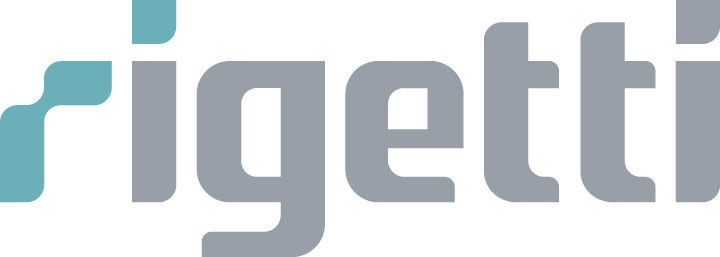
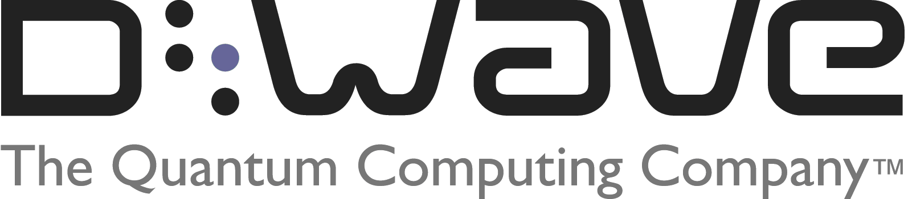
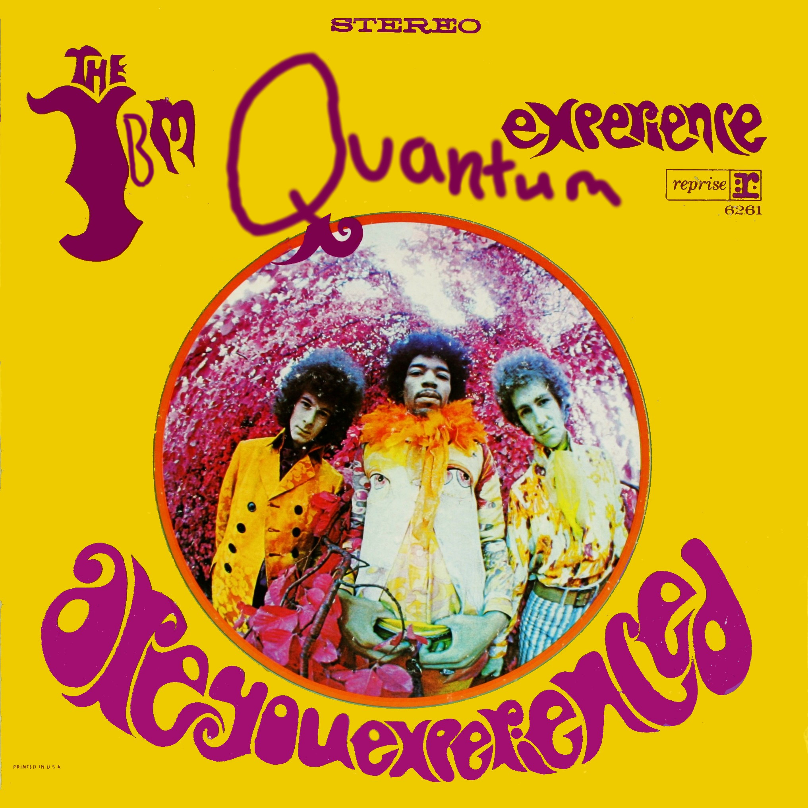
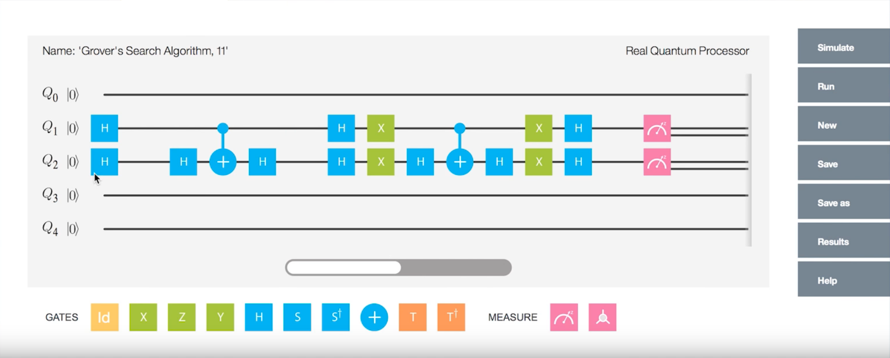

    
     

In a nice tie-in to Monday's [post][6], news broke yesterday that [Rigetti][7] is launching a **cloud API** and **development environment**, giving developers around the world remote access to Rigetti's in-house quantum computing hardware and software toolchain.

For those unfamiliar, Rigetti Quantum Computing is a self-proclaimed "full-stack" quantum computing company with an ambitious mission: to build the world's most powerful computer while **also** providing services that give access to said computer.

In layman's terms, they're trying to be **both** the **Intel** *and* the **Amazon Web Services** of this emerging field. 

## Competition

If they were the only player in quantum computing, this wouldn't be such a big deal, as the pioneer of any field often has to wear multiple hats. E.g. Oculus, as they split focus between developing hardware, software, and first-party content, while also handing out grant money to bootstrap their ecosystem.

In Rigetti's case, however, they're faced with competition on several sides:

### D-Wave

    
     

**D-Wave Systems** is arguably the **leader** in quantum hardware and their [customer list][12] includes Lockheed Martin, Google, and the US Federal Government. 
Presumably, there are also hedge funds using D-Wave computers to get the edge over the competition, but my evidence is limited to a [news article][13] and a job posting I once read on their website. Lack of hard evidence aside, given that "quants" love data science, and quantum computing is great at [annealing][15], I'd be shocked if there isn't at least one hedge fund running a quantum computer.

D-Wave seems to be ignoring cloud services, focusing all of their energies on developing breakthrough quantum computer **hardware**. This strategy seems to be working for them, as D-Wave's hardware is clearly in the lead. There's a reason that Google's quantum researchers conduct their research primarily on a D-Wave -- the latest D-Wave computer, the 2000Q, boasts a stunning 2048 qubits, compared to 30 from Rigetti or 17 from IBM.

As an aside: does the modern qubit fixation remind anyone else of the good old days where conventional computers moved rapidly from 8-bit to, 16-bit, 32-bit, and finally, 64-bit architectures? 

On the software front, D-Wave does not offer cloud access to their quantum computers, but in January they released [**Qbsolv**][14], their quantum solver engine. As with Rigetti's Forest offering, Qbsolv can be run on conventional hardware OR atop a D-Wave quantum computer. So, if you're eager to play around with quantum computing on your conventional rig, you can download Qbsolv and feed it quadratic unconstrained binary optimization problems ([QUBOs][20]). Sounds like a lovely way to spend a Sunday afternoon...

### IBM Quantum Experience

    
     

Is it just me, or has **IBM** been surprising us with their [neural][21] and [quantum][22] chips lately?

I'm not sure if these efforts will succeed or not. In the past, I've predicted IBM's demise and yet they continue to fight for relevancy as the world changes around them. It's 

Honestly, though, it seems like they have been making the right strategic moves in this space, as they were first to market with a quantum API, originally launching in May 2016, under the moniker "IBM Quantum Experience." 

    
     
    <em>
    The Quantum Experience
    </em>

 
My concerns with IBM are mainly in quality of execution / tactics, rather than top-level strategy. They seem to be making some very intelligent moves at the top level of the company (Bluemix, Quantum, Neuro), but are their offerings strong enough to compete in this increasingly vicious market?

Let's look at Quantum Experience.

At launch, it only provided access to a five-qubit processor and simulator. Since then, they've added a 16 qubit processor, expanded the SDK, and improved the capabilites of the simulator.

Rigetti seems to have the edge here, as Forest offers a 30 qubit processor and, based on my preliminary research of both SDKs, superior [documentation][9] and [API usability][18].

For a side-by-side comparison, see this example of quantum teleportation, implemented both in Rigetti's [Forest][16] and IBM's [OpenQASM][17], both in Python.

I have to give the Software edge to Rigetti, but IBM does have a neat GUI tool they call the "Quantum Composer."

    
     
    <em>
    The Quantum Composer
    </em>

As mentioned before, I'm [bullish][6] on visual programming, so it's great to see this from IBM.

However, whether Quantum Composer is meant for real-world programming or simply to be a training tool for new quantum programmers is not entirely clear. 

What I will say is, not having used Quantum Composer on the SDK, given what I've seen of UI design that I've seen so far, I'm guessing that serious programmers will gravitate more towards the text-based tools.

## Technical Deep-dive

I got really interested in what the technical differences were between the three players, so this section is less well-formatted than the rest of the post.

If you're not one for technical details, you may want to jump to the [conclusion](#conclusion).

### High-level Comparison

#### D-Wave - Qbsolv

##### Pros: 

* At first glance, Qbsolv seems to be a sound approach to QUBO problems.
* QUBO is equivalent to many optimization problems, making for a wide range of use cases, including machine learning and computer vision

##### Cons: 

* Qbsolv can ONLY solve QUBOs.  (But there are [third-party tools to solve non-QUBO problems][19]) 
* Qbsolv is the only released SDK from D-Wave
* No cloud-based access to D-Wave computers

#### Rigetti - Quil / Forest

##### Pros: 

* User-friendly API
* Good documentation
* Access to 30 qubit machine (if you have hardware access)

##### Cons: 

* Access to real quantum computers is restricted / members-only

#### IBM - OpenQASM / Composer

##### Pros: 

* Access to real quantum computers is open!
* Quantum Composer GUI

##### Cons: 

* Clunkier API

### Assembly Language Analysis

OpenQASM and Quil are vying for essentially the same ecological niche: an assembly language for hybrid conventional-quantum machines.

#### Similarity

Both languages describe how to design quantum gates, load/store from quantum and conventional registers, and execute computation. At first glance, one might think that this is a case of C# vs Java, or Ruby vs Python.

For example, reading from IBM's [Open QASM][10] whitepaper:

"The only storage types of Open QASM (version 2.0) are **classical and quantum registers**, which are one-dimensional arrays of bits and qubits, respectively."

Meanwhile, the components of an **Quil Quantum Abstract Machine (QAM)**: 

* A fixed but arbitrary number of qubits 
* A classical memory of bits
* A fixed but arbitrary list of static gates 
* A fixed but arbitrary list of parametric gates 
* A fixed but arbitrary sequence of Quil instructions 
* An integer program counter 

Students of Turing will find the above incredibly familiar! Seems a lot like the classical computer architectures we've studied in school. Makes sense, as these are both meant to be hybrid conventional-quantum architectures.

#### Difference

However, after looking at both languages, it seems like they have different goals!

Yes, the OpenQASM machine model is incredibly similar to that of Quil, but OpenQASM stresses a **hardware-oriented**, component-by-component view of the world! OpenQASM feels like Verilog or VHDL to me, more of a *hardware description language* than a programming language. 

In an earlier draft of this post, I went into myopic detail about the finer points of Quil vs OpenQASM assembly code, but decided to table that discussion in the interest of getting this post finished.

If you're eager to read more about the bits and bytes of quantum computing, I suggest checking out the [Quil][8] and [OpenQASM whitepaper][10]s. 

#### Two-qubit gate universality

As a quantum computing neophyte, I had a lot of fun researching this post.

Here's an excerpt from the Quil whitepaper which blew my mind (emphasis mine):

> It turns out that many different sets of these one- and two-qubit gates are **sufficient for universal quantum computation**, i.e., a discrete set of gates can be used to approximate any unitary matrix to arbitrary accuracy.  In fact **almost any two-qubit quantum gate can be shown to be universal**.

What an amazing insight! This is very remiscent of **[NAND universality][23]** from classical computing.

The universality of the two-qubit quantum gate also explains why both IBM and Rigetti are emphasisizing the various ways their two-qubit quantum gates can be combined in interesting ways.

Call me a geek, but this insight has piqued my interest in learning the nuts and bolts of quantum gates! One other reason to read more quantum computing research is the incredible names of the papers, e.g. "[Parametrically-Activated Entangling Gates Using Transmon Qubits][11]."

<a id="conclusion">

## What this means for Rigetti

In taking on both quantum hardware and quantum cloud services, Rigetti is biting off a lot, but the Forest launch puts their audacious vision squarely in reality; Rigetti Forest is a very credible quantum computing option which, in my opinion, is well-positioned to outshine IBM's Quantum Experience. 

Their hardware lead over IBM combined with their superior documentation and SDK design give them a credible advantage, so long as they can smoothly transition to general availability.

Running algorithms on real hardware is limited to "select partners" for now, unclear if due to shortage of quantum computers or bugginess/quirks that they are working out. 

If they are able to make this transition happen, while maintaining the pace on their hardware R&D, they'll be in a **strong position**.

## Predictions

Quantum computers are still rare, expensive devices. There are very few customers who can afford to pony up the $15 million for a brand-new D-Wave.

I think that Rigetti and IBM have the right idea in selling USAGE of quantum computers to mere mortals. I strongly suspect that D-Wave will follow along, offering cloud-based access to their machines. 

The only way that I can see this NOT happening is if D-Wave is somehow able to drive down the cost of their machines significantly. Indeed, many are predicting that, one day, quantum processors will be so **commonplace** that we'll have them in our smartphones. However, given the incredible need for power and refrigeration of the current quantum computers, I can't see this extreme miniaturization/resegmentation happening in the near future.

IBM looks to be in a **bleak** position as they are behind D-Wave and Rigetti in hardware, and their cloud offering seems to be weaker than Rigetti's, provided Rigetti Forest can successfully enter general availability.

In the Rigetti vs D-Wave race, Rigetti is still a heavy underdog. However, this MAY be an underdog to bet on.

Why? Take a look at these excerpts from the Forest announcement (emphasis mine):

> Fab-1 is based on the latest semiconductor processing tools and technology, but, unlike traditional fabs, operates in rapid-iteration mode. Today, we can produce an entirely new design for a 3D integrated quantum circuit in about **2 weeks**. 

2 weeks? Stunning.

More importantly, here's a man who understands productivity, prototyping, and the power of exponential technologies:

> Because of the **exponential value of iteration cycles in the development of any complex technology**, I expect Fab-1 to be a key driver and strategic advantage in our march towards ever greater processing power (more qubits, faster gate times) and performance (longer coherence times, lower error rates, greater connectivity) from quantum chips over the coming years.

This paragraph, more than anything else I've read from the company, gives me the faith that Rigetti will be able to deliver something incredible.

## Questions

If we can answer these questions, we'll know how this three-way race will play out:

1. Will D-Wave open up access to their powerful quantum hardware? Will doing so translate their hardware lead into greater revenue and a stronger market position?

2. Can Rigetti catch up to D-Wave's hardware by leaning hard on their rapid R&D?

3. Is there something to the Rigetti/IBM quantum computer than I'm missing? Perhaps these two machines are truly universal quantum computers, while D-Wave is locked strictly to the QUBO task? If so, then the qubits-versus-qubits argument holds little water and this is not a three-way race, as there will certainly be room for specialized vs generalized machines.

4. Does IBM, the old dog, have a new trick up its sleeve? It wouldn't be the first time.

[1]: https://www.research.ibm.com/ibm-q/ "IBM Q"
[2]: https://github.com/IBM/qiskit-sdk-py "IBM Q Python SDK"
[3]: https://medium.com/rigetti/introducing-forest-f2c806537c6d "Forest Announcement"
[4]: http://www.rigetti.com/index.php/forest "Forest Homepage"
[5]: https://juliacomputing.com/press/2017/06/19/funding.html "Julia Computing Raises $4.6M in Seed Funding"
[6]: http://www.davidykay.com/Whats-Next-in-Programming/ "What's Next in Programming?"
[7]: http://www.rigetti.com/ "Rigetti Quantum Computing"
[8]: https://arxiv.org/pdf/1608.03355.pdf "Quil whitepaper"
[9]: http://pyquil.readthedocs.io/en/latest/ "PyQuil docs"
[10]: https://github.com/IBM/qiskit-openqasm/raw/master/spec/qasm2.pdf "OpenQASM Spec"
[11]: http://www.rigetti.com/papers/Parametrically-Activated_Entangling_Gates_Using_Transmon_Qubits.pdf "Parametrically-Activated Entangling Gates Using Transmon Qubits"
[12]: https://www.dwavesys.com/our-company/customers "D-Wave Customers"
[13]: https://biv.com/article/2016/5/D-Wave-bringing-quantum-computing-to-finance/ "D-Wave bringing quantum computing to finance"
[14]: https://github.com/dwavesystems/qbsolv "Qbsolv"
[15]: https://en.wikipedia.org/wiki/Simulated_annealing "Simulated annealing"
[16]: https://github.com/rigetticomputing/pyquil/blob/master/examples/teleportation.py "Quil Teleportation Example"
[17]: https://github.com/IBM/qiskit-sdk-py/blob/master/examples/python/teleport.py "OpenQASM Teleport Example"
[18]: https://github.com/rigetticomputing/pyquil/blob/master/examples/meyer_penny_game.py "Quil Meyer Penny Game"
[19]: https://github.com/lanl/qmasm "QMASM for D-Wave"
[20]: https://en.wikipedia.org/wiki/Quadratic_unconstrained_binary_optimization "QUBO"
[21]: https://www-03.ibm.com/press/us/en/pressrelease/44529.wss "New IBM SyNAPSE Chip Could Open Era of Vast Neural Networks"
[22]: http://www-03.ibm.com/press/us/en/pressrelease/52403.wss "IBM Builds Its Most Powerful Universal Quantum Computing Processors"
[23]: https://www.electrical4u.com/universal-gate-nand-nor-gate-as-universal-gate/ "Universal Gate"
