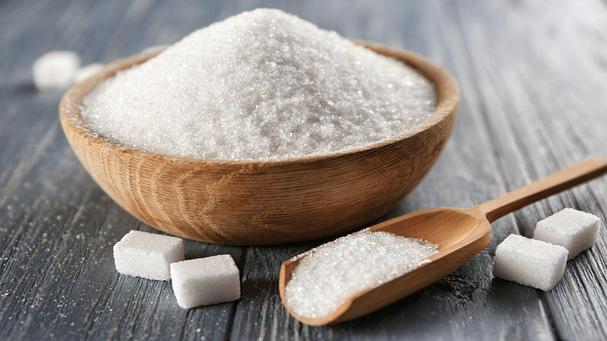

 

 

 

> There are no accidents in politics.
>  
> -- Theodore Parker

I have a brief story for you about disinformation.

You may have witnessed dietary advice recently shift from "fat is bad" to "sugar is bad."

How did we get it so wrong last time?

It turns out that the sugar industry [paid off][50] two researchers in 1965, using "approximately **$50,000** in today's dollars."

Can you imagine the **decades of harm** that $50,000 dollars caused? The millions of people affected by health issues from following *deliberately* sabotaged health guidelines?

What's worse, a [2016 study published in JAMA][51] finds that we aren't free of corrupt scientific inquiry, asking, "Is it really true that food companies deliberately set out to manipulate research in their favor? Yes, it is, and the practice continues."

The study concludes, "Policymaking committees should consider giving less weight to food industry-funded studies." 

Importantly, there is no reason to believe that the food industry is the only industry guilty of funding biased studies. 

Can you think of any modern industry that might stand much to gain by corrupting scientific inquiry?

[50]: https://jamanetwork.com/journals/jamainternalmedicine/article-abstract/2548255 "Sugar Industry and Coronary Heart Disease Research: A Historical Analysis of Internal Industry Documents"
[51]: https://jamanetwork.com/journals/jamainternalmedicine/article-abstract/2548251 "Food Industry Funding of Nutrition Research: The Relevance of History for Current Debates"
